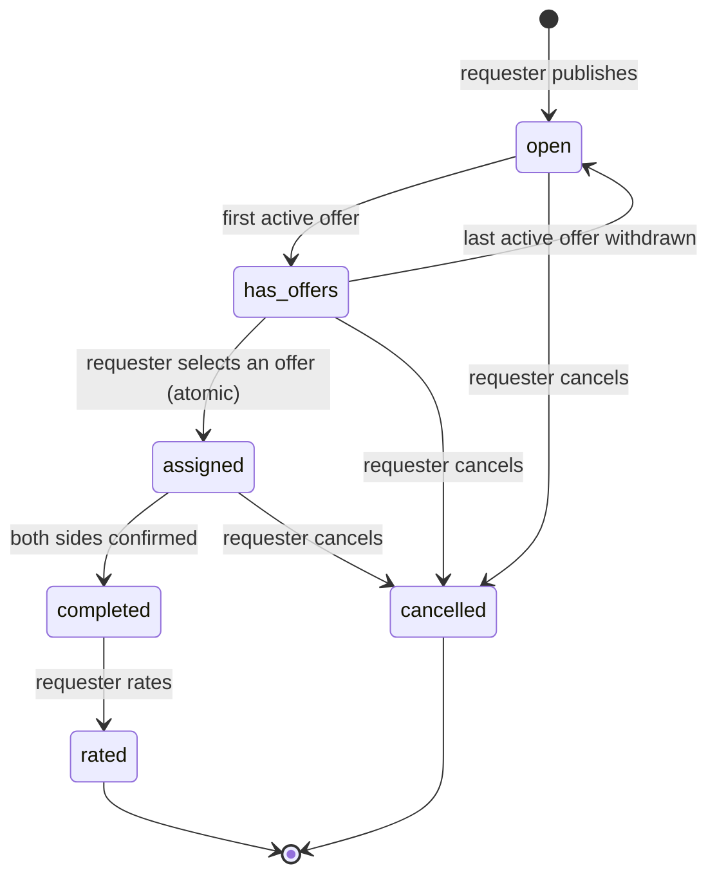

# iHelp — Product Specification

---

## 1. Executive Summary

iHelp is a local help marketplace that **reverses the search model**. Instead of a
person in need searching for a professional (browsing lists, calling around,
waiting for callbacks), the person **posts a help request** and verified helpers
nearby **compete to offer their help** — for pay or as volunteers. When the help is
done, both sides confirm completion and the requester rates the helper.

The reversal shortens the path to help: demand is published once and supply comes
to it, instead of demand chasing supply one phone call at a time. Trust is
symmetric by design — every user who transacts, requester or helper, passes an
admin-reviewed identity verification before their first transaction.

**MVP principle:** small, clean, working, and secure. The MVP implements the full
core loop (post → offer → assign → complete → rate) with verification, ratings,
distance-aware browsing, and an admin role — and deliberately nothing else.

---

## 2. The Problem

Finding trustworthy, available help quickly is hard:

1. **Discovery is slow and one-directional.** The person who needs help must
   search, compare, and contact providers one by one. Providers do not see the
   demand unless they are contacted directly.
2. **Trust is expensive to establish — and it must run in both directions.**
   Anyone can claim to be an electrician; reviews are scattered across platforms;
   credentials are rarely checked anywhere. The mirror problem gets even less
   attention: a helper answering a stranger's request walks into an unknown
   home. A platform that verifies only one side leaves the other exposed.
3. **Availability is opaque.** The requester cannot tell who is actually free and
   nearby *right now*; providers cannot see which requests near them are open.
4. **Small and volunteer-suitable tasks fall through the cracks.** Tasks that are
   too small for a business call-out (carrying furniture up stairs, help with a
   form, a ride to a clinic) often have willing neighbors — but no channel
   connecting them.

**Who feels this pain:** households needing repairs or errands; elderly people and
their families; new residents of an area with no local network; professionals and
willing neighbors who have spare capacity but no visibility into nearby demand.

---

## 3. The Solution

iHelp inverts the marketplace:

- A **requester** publishes a help request: title, description, category,
  optionally one or more photos (up to 5), and location — **no payment/pricing
  choice**. A request is simply a
  description of what is needed. **Pricing is entirely the helper's**: each offer
  declares one of three stances — a **fixed price** now, **volunteering** (free),
  or **"price decided after the job"** (many jobs, like a plumber's or
  electrician's, can't be quoted before the helper sees the problem; the final
  amount is entered once the work is done). Every request accepts all three.
- **Verified helpers** browse open requests — sorted by distance from them — and
  submit offers describing how they would help and at what price — or for free.
- The requester compares offers (helper profile, verification badge, average
  rating, **price**, offer message) and **selects one**. All other offers are
  closed automatically at that moment. Helpers compete on trust, speed, *and*
  price.
- After the work is done, **both sides confirm completion**, and the requester
  rates the helper (1–5 stars plus an optional note). Ratings accumulate on the
  helper's public profile, building the platform's trust layer.

Trust is built from two independent mechanisms:

1. **Identity verification before any transaction — on both sides.** A user must
   pass admin-reviewed identity verification before posting a request *or*
   submitting an offer (see §4.1). Requests summon real people to real places:
   a malicious requester could use a fake request to lure a helper, just as a
   malicious helper could exploit a requester's home. Verifying only one side
   would leave the other exposed, so iHelp gates both. Professionals can add a
   reviewed credential on top (see §4.3). A useful consequence: by the time
   phone numbers are mutually revealed at assignment (§8.4), **both** parties
   have passed admin review.
2. **Ratings after every job.** Reputation compounds per completed request.

### What iHelp deliberately is not (MVP)

- **Not a payment platform.** No money moves through the system. The *selected
  offer's* price (fixed, or set by the helper after the job) is carried as data;
  after completion the requester can tick a
  "paid" checkbox for record-keeping. Rationale: a real payment gateway adds a
  fragile, paid external dependency and heavy compliance scope with no learning
  value for the MVP; the marketplace mechanics are the product.
- **Not an emergency service.** A static information page lists real Israeli
  emergency numbers as plain phone links. See §11 — this is a hard boundary.
- **Not a chat app.** Coordination beyond the offer message (exact address, timing)
  happens outside the platform in the MVP; phone numbers are revealed mutually
  after assignment (see §8.4). A minimal in-app chat is a possible post-MVP
  addition.

---

## 4. Users and Roles

**One account, many hats.** iHelp has a single account type. The same person can
post a request in the morning and offer help on someone else's request in the
afternoon. Permissions are therefore attached to **rows, not accounts**: what you
may do with a specific request, offer, or rating depends on your relationship to
that row (owner, offerer, assignee), enforced at the database level with Row Level
Security (RLS). The only account-level flags are the identity-verification status,
the professional-credential status, and the admin flag.

### 4.1 Identity verification — the transaction gate

Registration alone allows browsing only. Before a user can **post a request or
submit an offer**, they must pass identity verification: they submit their full
name, phone number, and a short self-description, optionally with an ID photo
(stored privately, visible only to the applicant and admins), and an admin
manually approves or rejects the application with a note. Rejected users may
re-apply; the reviewing admin always sees the full application history, including
prior rejection notes, so resubmitting the same content does not get a fresh roll
of the dice. There is no re-apply cooldown in the MVP — accepted simplicity,
bounded by the rule that only one application per kind can be pending at a time
(§9.2).

Why both sides, and not just helpers: every transaction ends with two strangers
meeting in the physical world, usually at the requester's home. A malicious
*helper* threatens the requester — but a malicious *requester* can just as easily
use a fabricated request to lure a helper to an address. The gate is therefore
symmetric: nobody summons a person, and nobody answers a summons, without having
passed a human review first.

The MVP uses **manual admin approval** — no external identity/KYC or SMS service —
keeping the deployment free of fragile external dependencies while still putting
a human gate before every transaction. This is consciously weaker than
government-grade identity proofing; the limitation is documented openly (§14) and
stronger verification is on the security-document roadmap.

What review actually checks — and what it cannot: the admin reviews for
completeness and coherence (a plausible full name, a sensible self-description,
and a name match when an ID photo is provided); incomplete, implausible, or
abusive applications are rejected. The phone number is **not** validated in the
MVP — SMS OTP would reintroduce an external paid service — so it is treated as
coordination data, not identity evidence; SMS verification is a named roadmap
item in the security document. Requiring the ID photo was considered and
deferred: at MVP scale the admin can simply reject applications that feel thin
without one.

While an application is pending, the verification page shows a visible *pending
review* status. There are no notifications in the MVP (§10), so approval is
discovered on the applicant's next visit — accepted friction, bounded by review
turnaround: at MVP scale (tens of users, one pilot area) admins are expected to
review within hours, and §14 names the queue as the system's human bottleneck.

ID photos are retained while the account remains verified — they are the audit
trail behind approval and any later revocation decision; retention limits and
deletion are specified in the security document, parallel to §9.3's treatment of
location data.

### 4.2 Requester (any identity-verified user)

Any identity-verified user may post help requests. A requester can:

- publish, edit, and cancel their own requests;
- view all offers on their own requests and select one;
- confirm completion from their side;
- rate the helper after completion (once per request);
- mark a request as paid when the selected offer carries a price
  (record-keeping only).

### 4.3 Helper (any identity-verified user; professional credential optional)

Any identity-verified user may submit offers — the identity gate of §4.1 is the
trust prerequisite, and it has already been passed. On top of it, a helper may
apply for a **professional credential**:

| Badge | Who it is for | Evidence | Approval |
|---|---|---|---|
| **Verified** (baseline) | Every identity-verified user | Identity application of §4.1 | Admin (already granted) |
| **Professional** (add-on) | Licensed/certified trades and professions | Certificate/license document uploaded to private storage | Admin reviews the document and approves or rejects with a note |

The professional badge changes nothing about *what* a helper may do — offers,
completion, and ratings work identically — it changes what the requester *sees*
when comparing offers: a reviewed credential next to the offer. Skill signaling
is layered on top of identity trust, not a substitute for it.

A helper can:

- browse open requests, sorted by distance when location is available;
- submit one offer per request, and edit or withdraw it while it is active. A
  single editable offer keeps the requester's comparison view clean (one row per
  helper), prevents offer spam and self-competition, and editing covers the
  "I want to revise my terms" case without extra rows;
- see only their own offers on other people's requests — never competitors'.
  Offers are sealed-bid on purpose: hiding competing terms prevents a race to
  the bottom on price and protects helpers' pricing privacy, while the requester
  still compares all offers side by side. It also keeps the access rule simple:
  an offer is readable only by its owner and the request owner;
- confirm completion from their side once assigned.

Helpers have a public profile: display name, badge (verified / professional),
average rating, and rating count.

### 4.4 Admin

A small trusted set of accounts flagged as admin (a boolean on the profile, set
manually in the database — deliberately simple and auditable for MVP scale).
Admins:

- review and approve/reject verification applications of both kinds — identity
  (§4.1) and professional credential (§4.3) — including viewing privately-stored
  ID photos and certificates;
- perform basic moderation: hide an offensive request from browsing, or revoke a
  user's verification — per kind: revoking **identity** verification removes the
  right to post requests and to submit offers alike (work already in flight is
  untouched); revoking the **professional** credential removes only the badge.

Admins do **not** get blanket write access to user content; their capabilities are
scoped to the moderation actions above and enforced by the same RLS mechanism as
everything else.

---

## 5. The Customer

Users and customers are distinct:

- **Users** are requesters and helpers (§4).
- **The customer** — the party the business ultimately monetizes — is the
  **professional helper**. iHelp is, economically, a lead-generation channel:
  it delivers nearby, explicit, ready-to-buy demand to professionals. Comparable
  marketplaces monetize exactly this side (lead fees, subscriptions, or a
  commission per completed paid job).
- Requesters are intentionally **never charged** — charging the demand side would
  suppress the liquidity that makes the platform valuable to the supply side.
  Identity verification (§4.1) does impose a one-time, *non-monetary* cost on
  that same demand side; the two are deliberately different trades. The gate buys
  safety — without it helpers face real physical risk — and is paid once, while
  charging would be a recurring toll with no trust payoff. The gate is still
  expected to cost some demand-side conversion, and the §6 G2
  verification-completion metric exists precisely to watch that price.
- Volunteer activity is not monetized. It exists because it drives adoption,
  density, and goodwill — all of which increase the value of the paid side.

In the MVP no one is charged; the MVP's job is to validate the mechanics and the
demand (see §6).

---

## 6. Business Goals

1. **Validate the reversed-marketplace mechanic.** The hypothesis is that
   publishing a request gets help with less effort than outbound search. The MVP
   measures its own side with absolute targets: median **time to first offer**
   and the share of requests receiving ≥1 offer within 24 hours. (Outbound-search
   duration has no in-product baseline, so "faster than searching" stays a
   hypothesis these metrics support rather than a claim they prove.)
2. **Build a trust layer that compounds — on both sides.** Identity verification
   before any transaction (requester or helper), an optional reviewed professional
   credential, and a rating after every completion. Metrics: share of registered
   users completing identity verification, share of helpers holding the
   professional badge, average rating, share of completed requests that get rated.
3. **Reach local liquidity.** The product is only useful where enough helpers see
   enough requests. Distance-sorted browsing concentrates attention locally.
   Metric: completion rate (assigned → completed) within a pilot area.
4. **Create the future monetization surface.** Per-offer pricing stances
   (fixed / volunteer / price-after-job), agreed
   offer prices, and the paid-marker checkbox record exactly the data (volume and value
   of paid jobs per category/area) needed to price lead fees or commissions later —
   without operating payments now.
5. **Serve the community.** Volunteering is first-class, not a side case: every
   offer can be a volunteer offer, on any request.
   This widens adoption beyond commercial transactions and is the product's
   social contribution.

---

## 7. Required Product Capabilities

Capabilities the software must provide to enable the goals above, and why:

| # | Capability | Enables (goal §) |
|---|---|---|
| C1 | Account registration, login, and session management | All — identity underlies every permission |
| C2 | User profile with display name, phone number, and stored location (lat/lng captured via the browser's geolocation API, with user consent) | G1, G3 — distance sorting; the phone number is the post-assignment coordination channel (§8.4) |
| C3 | Help-request creation (identity-verified users only) with title, description, category, optional photos (0–5, uploaded to storage), and location — no payment choice (pricing is the helper's, per offer) | G1, G2, G4 |
| C4 | Request browsing for helpers: open requests sorted by distance (computed in application code with the Haversine formula — no external geocoding/maps service); graceful fallback to unsorted list when the user declines location permission | G1, G3 |
| C5 | Offer submission, editing, and withdrawal by identity-verified users; offer visibility restricted to the offer's owner and the request's owner | G1, G2 |
| C6 | Atomic offer selection: choosing one offer assigns the request and closes all competing offers in a single transaction (no partial states visible to users) | G1 — the marketplace's pivotal moment must be reliable |
| C7 | Dual-sided completion: each side independently confirms; the request becomes *completed* only when both have | G2 — prevents one side unilaterally closing a disputed job |
| C8 | Rating: requester rates the helper once per completed request (1–5 stars + optional note); helper profiles show average and count | G2 |
| C9 | Two-kind verification workflow — identity applications (required to transact) and professional-credential applications — with private-storage uploads and an admin review queue (approve/reject + note) | G2 |
| C10 | Admin moderation: hide a request from browsing, revoke a verification | G2 — trust requires recourse |
| C11 | Paid-marker checkbox on completed requests whose selected offer carries a price | G4 |
| C12 | Database-level permission enforcement for every capability above — RLS policies, plus unique/check constraints and narrowly-scoped SECURITY DEFINER functions where a rule spans rows or must be atomic | All — trust claims are empty if the data layer doesn't enforce them |
| C13 | Static emergency-resources page (see §11) | Duty of care; deliberately **not** a business capability |

Measurement note: the schema records creation timestamps and every status
transition, so all §6 metrics are computable with direct SQL. An in-app
reports/analytics UI is deliberately out of scope (§10).

Out of scope for MVP (deliberate): real payments, video upload, in-app chat,
notifications, geocoding/address-search APIs, PostGIS (a display-only
Leaflet + OpenStreetMap map is included — see §10). Each is either a fragile/paid
external dependency or scope that does not test the core mechanic.

---

## 8. Core User Processes

### 8.1 Registration, login, and profile

1. A visitor signs up with email + password and receives an account.
2. On first login the user sets a display name and is asked (browser permission
   prompt) to share their location; if granted, lat/lng is saved to their
   profile. Declining location is fully supported — the app then shows unsorted
   lists (C4). The phone number is captured later, as part of identity
   verification (§8.2) — it is used solely for post-assignment coordination, and
   §8.4/§9.3 define exactly when it is revealed.
3. The user can update their profile and re-capture their location at any time.
   This includes the phone number: it is coordination data, not reviewed identity
   evidence (§4.1 — the MVP does not validate it either way), so editing it does
   not trigger re-verification.

### 8.2 Getting verified — identity first, credential optional

1. Any registered user opens "account verification" and submits the identity
   application (§4.1): full name, phone number (saved to the profile), a short
   self-description, and optionally an ID photo (stored privately, visible only
   to the applicant and admins).
2. The application enters the admin review queue with status *pending*. An admin
   approves — the user may now post requests and submit offers — or rejects with
   a note (the user may re-apply).
3. An identity-verified user may additionally apply for the **professional
   badge** by uploading a certificate/license file (same private storage, same
   review flow). Approval adds the badge shown beside their offers; rejection
   leaves them a verified, non-professional helper.

### 8.3 Posting and managing a help request (requester)

Posting requires identity verification (§4.1); an unverified user is redirected
to the verification flow of §8.2.

1. The requester fills in title, description, category, optionally uploads up to
   five photos, and confirms the
   request location (defaults to profile location). Photos are encouraged but not
   required: they raise request quality and legitimacy, deter spam and low-effort
   posts, and let helpers scope the work before offering. For tasks with nothing
   physical to show (a form, a ride), no photo is needed.
2. The request is published with status **open**, visible to signed-in users.
3. The requester may edit the request while no offer has been selected, and may
   cancel it at any point before completion (cancellation is terminal and closes
   any active — or selected — offers).

### 8.4 Offering, selecting, and completing (the core loop)

Offering requires identity verification (§4.1), mirroring the posting side: an
unverified user can view open requests, but attempting to offer redirects to the
verification flow of §8.2.

1. A verified helper browses open requests (distance-sorted), opens one, and
   submits an offer: a message and a pricing stance — a fixed price, no
   price at all (volunteering), or defer pricing until the job is done — the
   final amount is then entered by the helper after both sides confirm
   completion. Any stance is valid on any request; helpers compete on price as
   well as trust.
   The request's status becomes **has_offers** on the first active offer.
2. The requester reviews offers side by side — each shows the helper's name,
   badge, average rating, pricing stance (fixed price / volunteer /
   price-after-job), and message — and **selects one**. Atomically: the
   request becomes **assigned**, the chosen offer becomes *selected*, and all
   other offers become *closed*. The database is never in a partial state; the
   losing offerers see the closed status the next time they view their offers
   (the MVP has no push notifications — §10).
3. After assignment, the request page reveals — to these two users only — each
   party's display name and phone number (captured at identity verification,
   §8.2), and they coordinate
   the actual help off-platform (MVP has no chat). The exposure follows the
   permission matrix (§9.2) and is implemented as a dedicated, narrowly-scoped
   read path rather than by opening up profile access.
4. When the help has been carried out, each side presses "confirm completion".
   When **both** have confirmed, the request becomes **completed**. One-sided
   confirmation leaves it *assigned* with a visible "waiting for the other side"
   indicator.
5. When the selected offer carries a price (fixed, or entered after the job),
   the requester may tick "paid" — informational only; it does
   not gate anything.

### 8.5 Rating

1. On a completed request, the requester (only) rates the helper: 1–5 stars and an
   optional free-text note. Exactly once per request.
2. The request becomes **rated** (terminal). The helper's profile average and
   count update.

Rating is deliberately one-directional in the MVP. It answers the platform's
single trust-critical question — *can this helper be trusted with my job?* —
which is also the monetizable one (§5). Two-sided ratings would roughly double
the rating schema, policies, and UX without testing the core mechanic;
requester-side reputation is a named post-MVP item (§10). Ratings are visible to
any signed-in user on the helper's profile — a public trust signal is the point.
Immutability means the *parties* cannot edit a submitted rating, which blocks
post-hoc pressure on the requester to soften it; the MVP has no rating
moderation, an accepted and documented limitation (§10).

### 8.6 Admin review and moderation

1. An admin opens the admin dashboard: pending verification queue and a
   moderation view.
2. For each verification application: view details (and certificate, if any),
   approve or reject with a note.
3. Moderation actions: **hide** an offensive request (a hidden flag enforced by
   the read rule in §9.2 — the request's lifecycle state is untouched, and its
   owner, its selected helper, and admins still see it); **revoke a user's
   verification**, per kind: revoking identity verification removes the right to
   post requests and to submit offers alike (requests and assignments already in
   flight are untouched — admins may additionally hide a revoked user's open
   requests); revoking the professional credential removes only the badge. Admins
   learn about problems out-of-band (e.g., email) in the MVP — there is
   deliberately no in-app reporting pipeline (§10; see also the intake prohibition
   in §11). The moderation view is a plain request list with hide/unhide, not a
   report queue.

### 8.7 Emergency resources (informational)

Any user can open a static page listing real emergency numbers as tap-to-call
links. No form, no submission, no logic. See §11.

---

## 9. Request Lifecycle

### 9.1 State machine

Notes:

- **has_offers** is a convenience status for browsing/filtering; it is maintained
  automatically by the system (never set directly by a user) and collapses back to
  *open* if all offers are withdrawn.
- **completed** requires both `completed_by_requester` and `completed_by_helper`
  to be true. Each side can set only its own flag, and only while the request is
  *assigned*. Dual confirmation is the fairness mechanism: neither side can close
  the job (and trigger rating) unilaterally.
- **cancelled** is terminal and allowed at any point before *completed*.
  Cancelling an *assigned* request also closes the selected offer. This protects
  requesters whose circumstances change. The cost asymmetry to helpers (wasted
  preparation, and no reputational mark on the requester — the MVP has no
  requester-side reputation) is an accepted MVP limitation; surfacing requester
  cancellation counts is a named roadmap item (§10). A serially-cancelling
  requester does still punish themselves — they never get help — but the doc does
  not claim the rating system protects helpers here, because it does not.
- There is deliberately **no assigned → open recovery transition**. If the
  selected helper disappears or backs out, the requester's exit is
  cancel-and-repost. Terminal-cancel-only keeps the state machine and the atomic
  assignment logic simple at MVP scale; an un-assign/re-open transition is a
  named post-MVP improvement (§10).
- **rated** is terminal. Ratings are immutable once submitted — the parties
  cannot edit them after the fact (rationale in §8.5).

### 9.2 Permission matrix (enforced by RLS, not just UI)

| Action | Who may perform it | Condition |
|---|---|---|
| Publish request | Identity-verified users only | — |
| View request | Any signed-in user | Status ∈ {open, has_offers} and not hidden; owner, selected helper, and admins also view later states and hidden requests |
| Edit request | Request owner only | Status ∈ {open, has_offers} |
| Cancel request | Request owner only | Any status before *completed* |
| Submit offer | Identity-verified users only | Request status ∈ {open, has_offers}; not on own request; one active offer per helper per request |
| View offer | Offer owner and request owner only | The requester's comparison view lists only *live* offers (active/selected); a withdrawn or auto-closed offer disappears for the requester but remains visible to its own owner as history |
| Edit/withdraw offer | Offer owner only | While offer is *active* |
| Select offer (assign) | Request owner only | Status = has_offers; executed atomically |
| Confirm completion (requester side) | Request owner only | Status = assigned |
| Confirm completion (helper side) | Selected helper only | Status = assigned |
| Mark as paid | Request owner only | Status ∈ {completed, rated}; only when the selected offer carries an agreed amount (a fixed price, or a final price the helper set after the job) — a volunteer job has nothing to mark |
| Rate | Request owner only | Status = completed; once per request |
| View rating | Any signed-in user | Status = rated; shown on the helper's profile |
| View counterpart contact details | Request owner and selected helper only | Status ∈ {assigned, completed, rated}; via a dedicated, narrowly-scoped read path |
| Submit verification application | Any registered user | Per kind (identity / professional): no pending or approved application of that kind already exists; professional requires approved identity |
| View verification application (incl. certificate) | Applicant and admins only | — |
| Approve/reject verification | Admins only | Application is *pending* |
| Hide/unhide request, revoke verification | Admins only | — |

Every row above is enforced at the database layer and specified in the technical
design document. Most rows map directly to RLS policies; rules that span rows or
must be atomic map to unique/check constraints and narrowly-scoped SECURITY
DEFINER functions — the atomic assignment RPC, the per-side completion updates,
and the counterpart-contact read path. The UI mirrors these rules for usability,
but the database is the authority — a crafted API request cannot bypass what it
denies.

One accepted trade-off is stated here rather than hidden: a requester may edit a
request while offers are active, so an offer can predate a material change to the
request. Offer owners always see the request's current content and may revise or
withdraw a still-active offer in response; automatically invalidating offers on
edit is deliberate complexity the MVP avoids.

### 9.3 Privacy note on location

Distance sorting requires request coordinates to be readable by signed-in users.
List views show only a distance ("2.4 km away"), and the feed map surfaces
request locations as pins **by design** — requests carry a location the
requester explicitly confirms at publish time, knowing it identifies the
request's place. Profile **home** coordinates follow a stricter rule and remain
private (readable by their owner only). Exact request-coordinate exposure to
signed-in users is a known, documented MVP decision; coordinate rounding or
server-side distance computation are listed as improvements in the security
document.

The phone number follows a stricter rule than coordinates: it is readable only by
the assigned counterparty of a request (§9.2), and the identity-verification
application form — where it is captured (§8.2) — states exactly when it will be
revealed.

---

## 10. MVP Scope

### In scope

- Email/password auth; profile with display name, phone number, and optional
  geolocation
- Help requests: create/edit/cancel by owner, category, optional photos (0–5),
  location, full lifecycle of §9 (no payment choice — pricing is the helper's)
- Distance-sorted open-request browsing (Haversine, in-app), unsorted fallback
- Offers: create/edit/withdraw, visibility rules, atomic selection
- Post-assignment mutual contact reveal (display name + phone, parties only)
- Dual-sided completion; paid marker
- Ratings (1–5 + note, visible to signed-in users) and helper profile aggregates
- Verification: identity gate for all transacting users (name, phone, optional
  ID photo) + optional professional credential (certificate upload); one admin
  review queue for both kinds
- Admin moderation: hide request, revoke verification
- Static emergency-resources page
- Hebrew RTL UI throughout; English code and comments

### Out of scope (MVP) — each is a deliberate decision

| Excluded | Why |
|---|---|
| Real payment processing | Fragile/paid external dependency; compliance scope; the mechanic is testable without it |
| In-app chat | Coordination works off-platform after contact exchange; chat is the first post-MVP candidate |
| Video on requests | Storage/bandwidth cost disproportionate to MVP value; photos suffice |
| Push/email notifications | Polling the UI suffices at MVP scale |
| PostGIS / geocoding (address-search) APIs | Distance uses Haversine in TypeScript (sufficient at city scale, dependency-free). A **display-only** map (Leaflet + OpenStreetMap raster tiles, no API key) is included: a picker on the request form, a location map on the detail page, and a **feed map** with a pin per open request whose popup summarizes the request. **Address search/geocoding** is excluded — it needs a paid/keyed service and would dent the deploy's independence |
| Editing/deleting ratings (incl. admin moderation of rating notes) | Parties cannot edit a submitted rating — this blocks post-hoc pressure on the requester to soften it; the absence of rating moderation is an accepted, documented limitation |
| Two-sided ratings / requester reputation (incl. surfacing cancellation counts) | Requester-only rating answers the single monetizable trust question (§8.5); requester-side reputation is the first trust-layer extension after MVP |
| Un-assign / re-open transition | Cancel-and-repost is accepted friction; terminal-cancel-only keeps the state machine and atomic assignment simple (§9.1) |
| Reports/analytics dashboards | Every §6 metric is computable with direct SQL over recorded timestamps and status transitions (§7); a reporting UI adds no MVP learning |
| In-app reporting/flagging pipeline | Admins act on out-of-band complaints (§8.6); an intake surface is deliberately avoided (§11) |

---

## 11. Emergency Resources Page — Hard Boundary

A single **static** page, reachable from the main menu, listing real Israeli
emergency numbers as plain telephone links that open the device's dialer:

| Service | Number |
|---|---|
| Police (משטרה) | 100 |
| Magen David Adom — medical (מד״א) | 101 |
| Fire & Rescue (כיבוי והצלה) | 102 |
| ERAN — emotional first aid (ער״ן) | 1201 |
| Sexual assault crisis hotline — women (קו סיוע לנפגעות תקיפה מינית) | 1202 |
| Sexual assault crisis hotline — men (קו סיוע לנפגעי תקיפה מינית) | 1203 |

**Hard constraints — the page is information only:**

- No business logic of any kind. No button that claims to dial, alert, or dispatch
  on the user's behalf; links are plain `tel:` anchors that open the phone dialer.
- No intake: no form, endpoint, or database table that accepts reports of assault,
  distress, or emergencies.
- The page carries a clear notice that iHelp is not an emergency service and that
  in an emergency the user should call the numbers directly.

Rationale: any feature that *appears* to summon help creates a life-safety
expectation the product cannot meet, and collecting crisis reports creates data
and duty-of-care obligations far outside this product's scope. If any future
requirement seems to demand intake/dispatch behavior, work stops pending an
explicit product decision.

---

## 12. Non-Functional Requirements

- **Language & direction:** all UI copy in Hebrew, RTL layout. Code, comments,
  commit messages, and documentation in English.
- **Security:** every table holding user data is protected by RLS; the permission
  matrix of §9.2 is enforced in the database. Secrets live in environment
  variables, never in the repository. (Full treatment: security document.)
- **Availability & independence:** deployed on Vercel with Supabase, publicly
  reachable by URL. Beyond Supabase/Vercel, the one third-party runtime
  dependency is OpenStreetMap raster tiles — display-only, keyless, free; a
  tile-server outage degrades to a blank map square, never breaks a flow.
  Nothing fragile or paid that could break the demo or the deployment.
- **Performance (MVP scale):** list views paginated; images size-limited at
  upload; distance computed client/server-side in code without external calls.
  (Full treatment: scale document.)
- **Usability:** the core loop must be completable by a first-time user without
  instructions; helper trust signals (badge, rating) visible wherever a helper
  appears.

---

## 13. Success Criteria (for this project)

1. The full core loop — post → offer → assign → dual-complete → rate — works on
   the deployed public URL.
2. Every permission in §9.2 is enforced at the database layer — RLS policies,
   unique/check constraints, or constrained SECURITY DEFINER functions — and
   demonstrated by tests that attempt forbidden actions and observe denial.
3. An identity application can be approved from the admin dashboard, and only
   then can that user post requests or submit offers; a professional-credential
   application can likewise be approved and its badge appears beside the
   helper's offers.
4. Distance sorting works with granted location permission and degrades
   gracefully without it.
5. All submission documents, the test suite, and the deployed app are
   consistent with each other — every claim in a document is true in the code.

---

## 14. Assumptions, Constraints, and Risks

**Assumptions**

- Users have smartphones or desktops with a modern browser; helpers grant
  location permission often enough for distance sorting to matter.
- MVP-scale traffic (tens of users, hundreds of requests) — informs the scale doc.
- Hebrew-speaking Israeli audience.

**Constraints (from the assignment and settled decisions)**

- Stack: Next.js + TypeScript, Supabase (DB/Auth/Storage), Vercel, public URL.
- Git repository from day one with continuous commits.
- Every technical decision must be explainable and defensible in review.

**Risks and mitigations**

| Risk | Mitigation |
|---|---|
| Cold start: helpers see no requests, requesters get no offers — compounded by the identity gate, which delays every new user's first contribution | Pilot-area focus; volunteer offers widen the helper pool; seeded, pre-approved demo accounts for presentation; verification is reachable straight from signup and reviewed within hours at pilot scale — the gate adds latency, not a wall |
| Manual review queue becomes the bottleneck (every transacting user passes through it) | Acceptable at MVP scale: hours-level turnaround, visible *pending* status (§4.1). Queue length is the first scale signal to watch; semi-automated checks (e.g., SMS OTP) are the roadmap answer in the scale/security documents |
| Weak identity verification (manual admin approval is not government-grade identity proofing) | Documented openly as an MVP limitation; applies symmetrically to both sides; optional ID photo strengthens review; stronger verification (e.g., document checks) listed in security doc roadmap |
| Malicious requester lures a helper with a fabricated request (mirror: malicious helper exploits a requester) | Symmetric identity gate (§4.1) — no one transacts without passing human review; phone numbers revealed only after mutual commitment at assignment (§8.4); admin can revoke verification either way; residual physical-world risk documented honestly — no platform eliminates it |
| Off-platform coordination leaks value (users bypass rating) | Completion + rating is the only way to build reputation, which helpers need for future work |
| Location privacy (coordinates readable via API) | §9.3 mitigations now; rounding/server-side distance in roadmap |
| Disputed completion (one side refuses to confirm) | Request stays *assigned* with a visible waiting indicator; the requester can still cancel. The MVP has no in-product escalation path — admins hear about problems out-of-band (e.g., email), and dispute tooling is a named roadmap item |
| Assigned helper no-shows or backs out | Requester cancels and re-posts (accepted friction, §9.1); an un-assign/re-open transition is a roadmap item (§10) |

---

## 15. Glossary

| Term | Meaning |
|---|---|
| Requester | The user who published a help request (a per-request role, not an account type); must be identity-verified |
| Identity verification | Admin-reviewed application (full name, phone, self-description, optional ID photo) required before posting or offering — the symmetric trust gate of §4.1 |
| Helper | An identity-verified user acting as offerer on a request (a per-request role, not an account type) |
| Professional helper | Helper who additionally holds the reviewed certificate/license badge |
| Offer | A helper's proposal on a specific request |
| Assignment | The requester's atomic selection of one offer |
| Dual completion | Both parties independently confirming the help was carried out |
| RLS | Row Level Security — PostgreSQL's per-row permission mechanism; the primary (though not sole — see §9.2) database enforcement layer |
