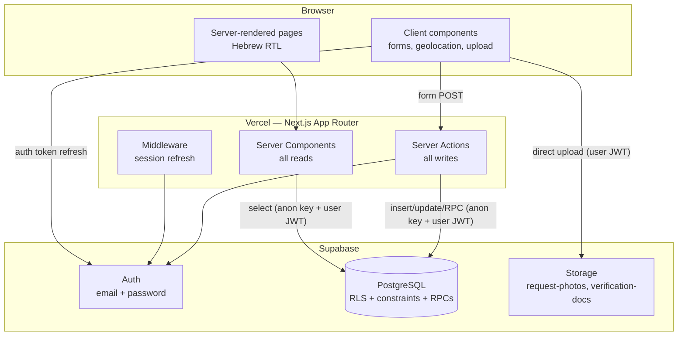
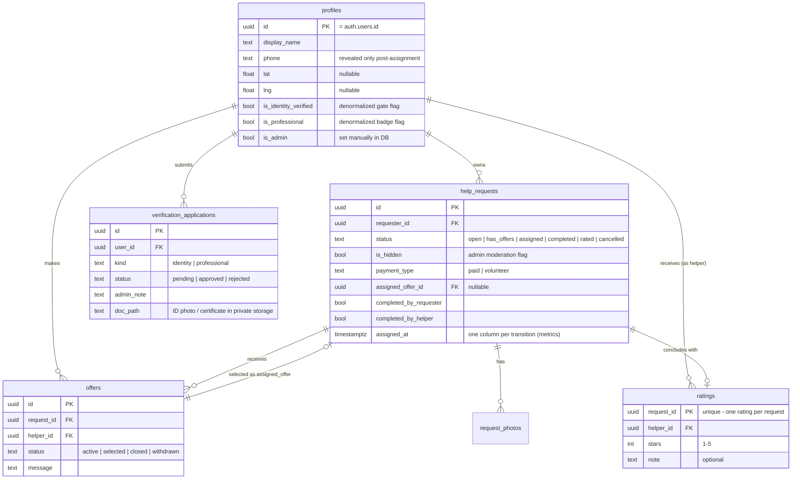
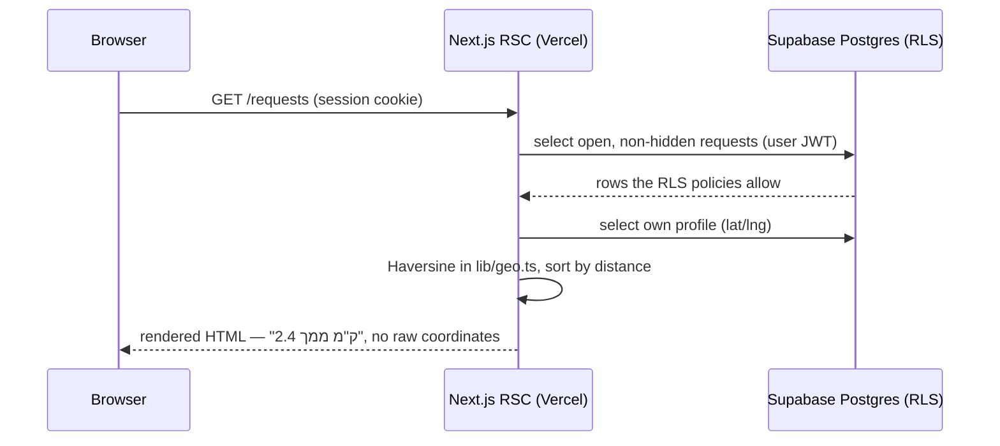
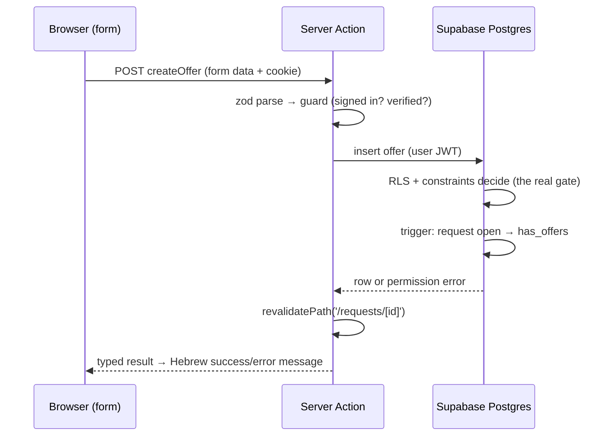

# iHelp — Architecture

**Course:** Internet Technologies — Become a Full-Stack Engineer, RUNI CS 2026
**Document:** 2 of 6 (Architecture, assignment stage 3)
**Depends on:** `01-product-spec.md` (all product rules referenced here are defined there)
**Status:** Draft for review

---

## 1. Overview and Guiding Principles

iHelp is a three-tier application with deliberately few moving parts:

- **Browser** — React UI rendered by Next.js. Hebrew, RTL.
- **Next.js app on Vercel** — server-rendered pages (React Server Components) for
  reads, Server Actions for writes. No separate backend service.
- **Supabase** — PostgreSQL (with Row Level Security), Auth, and Storage.

Principles that shaped every choice below:

1. **The database is the authority.** Every permission in the product spec's §9.2
   matrix is enforced in PostgreSQL (RLS policies, constraints, and a small set of
   SECURITY DEFINER functions). The UI and server code repeat those checks only
   for usability — nothing depends on them for safety.
2. **Smallest possible surface.** One web app, one database, no custom API server,
   no background workers, no queues. Fewer parts to build, test, secure, and
   explain.
3. **Zero fragile dependencies.** No external API beyond Supabase and Vercel — no
   geocoding, no payment gateway, no SMS. Demo day cannot be broken by a
   third-party outage or an expired trial key.
4. **Hebrew RTL UI, English code.** UI copy lives in one Hebrew strings module;
   code, comments, and docs are English.

---

## 2. System Components



**What deliberately does not exist:** a custom Express/API server (Next.js *is*
the backend), a service-role Supabase client in application code (see §9), client
state libraries, realtime subscriptions, background jobs, and any third-party API.

---

## 3. Technology Choices and Why

| Choice | Why |
|---|---|
| **Next.js (App Router)** | Mandated stack. App Router chosen over Pages Router: Server Components make reads server-side by default (data never over-fetched to the client, coordinates can stay on the server — §8.1), Server Actions give type-safe mutations without hand-rolling an API layer, and nested layouts fit the app's shell (nav + RTL direction set once). |
| **TypeScript** | Mandated. One language across UI, actions, and validation schemas. |
| **Supabase** | Mandated. Postgres RLS is the mechanism that makes "the database is the authority" real; Auth and Storage integrate with the same user identity, so one JWT drives DB policies *and* storage policies. |
| **Vercel** | Mandated. Native Next.js hosting; preview deployments per commit help the incremental-commits workflow. |
| **`@supabase/ssr`** | The supported way to use Supabase Auth in App Router: cookie-based sessions readable in Server Components, Server Actions, and middleware. Hand-rolling cookie/session handling around `supabase-js` is exactly the kind of security-sensitive code we should not write ourselves. |
| **Zod** | One schema per form, used twice: client-side for instant feedback, server-side inside the Server Action as the real gate. Single source of truth for input validation (assignment stage 4 requires explicit input validation). |
| **Tailwind CSS** | Utility CSS with **logical properties** (`ms-*`/`me-*`, `text-start`) makes RTL correct by construction instead of by `direction`-specific overrides. No component library — the UI is small enough to own, and it avoids fighting a library's LTR assumptions. |
| **React `useActionState` + plain forms** | Form state and server errors without a form library; the forms here are small (≤ ~8 fields). react-hook-form would be justified only with heavy dynamic forms. |

**Considered and rejected:** Redux/Zustand (server components make the server the
source of truth; there is no cross-page client state), PostGIS (Haversine in
TypeScript is sufficient at city scale — product spec §10), component libraries
(RTL friction, visual sameness), tRPC (Server Actions already provide typed
mutations), Supabase Realtime (product spec excludes push — polling on navigation
suffices).

---

## 4. Database

Full schema with column-level detail, constraints, and every RLS policy comes in
document 3 (technical design). Architecture-level view:

### 4.1 Entities



Notes on the shape:

- **`profiles` is 1:1 with `auth.users`** (created by trigger on signup). The
  `is_identity_verified` / `is_professional` flags are denormalized from
  `verification_applications` on approval so that RLS policies and page guards
  check one boolean instead of joining application history. The applications
  table remains the audit trail (product spec §4.1: admins see full history).
- **`request_photos` is a table, not an array column** — photos need per-row
  storage paths and ordering, and a table row per photo maps 1:1 to a storage
  object for cleanup.
- **Status-transition timestamps are columns** (`assigned_at`, `completed_at`,
  `rated_at`, `cancelled_at`, plus `created_at`) rather than a history table:
  the state machine is linear, so one timestamp per state fully records every
  transition (product spec §7 measurement note) with zero extra machinery.
- **`assigned_offer_id`** on the request plus `status` on the offer is redundant
  on purpose: the request points at the winning offer (fast reads), the offer
  status makes competitor offers self-describing (a helper's "my offers" list
  needs no join through requests).

### 4.2 Database-side logic (and why it lives there)

| Mechanism | What it does | Why in the DB and not app code |
|---|---|---|
| RPC `assign_offer(request_id, offer_id)` | Sets request to *assigned* + stamps `assigned_at` + marks chosen offer *selected* + closes all competing offers, in one transaction | The marketplace's pivotal moment must be atomic; RLS alone cannot authorize the caller to write competitors' offers, and app-side sequential updates could fail halfway (product spec §7 C6) |
| RPC `confirm_completion(request_id)` | Sets the caller's own completion flag (requester or helper side, derived from who calls); flips status to *completed* when both flags true | "Each side may set only its own flag" is an old-vs-new column rule that RLS UPDATE policies cannot express (product spec §9.2) |
| RPC `get_counterpart_contact(request_id)` | Returns the other party's display name + phone, only to the request owner or selected helper, only from *assigned* onward | Column-level conditional exposure — row-level SELECT policies cannot reveal one column to one pair of users per row (product spec §8.4) |
| Trigger on `offers` | Maintains request status `open ↔ has_offers` on offer insert/withdraw | The invariant must hold no matter which code path writes an offer; a trigger cannot be forgotten |
| Trigger on `auth.users` | Creates the `profiles` row on signup | Guarantees profile existence for every authenticated user |
| Constraints (unique, check) | One active offer per helper per request; one rating per request; stars 1–5; status transitions guarded | Cross-row uniqueness and value ranges belong to the schema, not to goodwill |

All three RPCs are `SECURITY DEFINER` with explicit permission checks in their
body — they are the *only* code that bypasses RLS, they are small, and they are
enumerated here so the security document can audit exactly three functions.

---

## 5. Storage

Two private buckets; access via storage RLS policies keyed to the same user JWT:

| Bucket | Contents | Write | Read |
|---|---|---|---|
| `request-photos` | Request images | Request owner, into their own folder (`{user_id}/…`) | Any signed-in user (photos are part of the public request card) |
| `verification-docs` | ID photos, certificates | Applicant, into their own folder | Applicant + admins only |

**Uploads go directly from the browser to Supabase Storage** (authenticated with
the user's JWT), and only the resulting storage path is sent to the Server
Action. Rationale: Server Actions have a ~1 MB request-body default and Vercel
serverless functions cap payloads around 4.5 MB — proxying multi-megabyte photos
through the app server would hit both limits and double the bandwidth. Client-side
size/type checks (and a storage-side size limit) keep uploads bounded.

---

## 6. Pages

All pages are App Router routes under one RTL Hebrew layout. "Gate" = redirect to
verification flow when the action requires an identity-verified user (product
spec §4.1); the true enforcement is in the DB.

| Route | Purpose | Access |
|---|---|---|
| `/` | Landing → redirects to `/requests` when signed in | Public |
| `/login`, `/signup` | Email/password auth | Public |
| `/requests` | Browse open requests, distance-sorted when location known | Signed-in |
| `/requests/new` | Post a request (photos, category, paid/volunteer, location) | Signed-in + gate |
| `/requests/[id]` | Request detail: offers (owner sees all, helper sees own), offer form, assignment, contact reveal, dual completion, rating | Signed-in (row visibility per RLS) |
| `/my/requests` | My posted requests by status | Signed-in |
| `/my/offers` | My offers and their statuses | Signed-in |
| `/helpers/[id]` | Public helper profile: name, badge, avg rating, rating list | Signed-in |
| `/profile` | Own profile: display name, phone, re-capture location | Signed-in |
| `/verification` | Identity application; professional upgrade; pending/rejected status | Signed-in |
| `/admin` | Verification queue (approve/reject with note) + moderation list (hide/unhide, revoke) | Admin (RLS-backed) |
| `/emergency` | **Static** emergency numbers page, `tel:` links only | Public |

The emergency page is a static route with zero data access — no client JS beyond
the layout, no form, no table behind it (product spec §11 hard boundary).

---

## 7. Server Actions and RPC Inventory

Every mutation is a Server Action following one pattern:
**zod-validate input → cheap guard (fail fast, friendly Hebrew error) → Supabase
call (RLS/RPC is the real gate) → `revalidatePath` → typed result to the form.**

| Action | Validates | DB effect |
|---|---|---|
| `signUp`, `signIn`, `signOut` | credentials schema | Supabase Auth; profile row via trigger |
| `updateProfile` | name/phone/location schema | update own `profiles` row (RLS: own row only) |
| `submitIdentityApplication` | application schema | insert `verification_applications` (kind=identity) |
| `submitProfessionalApplication` | application schema | insert `verification_applications` (kind=professional) |
| `createRequest` | request schema (≥1 photo path) | insert `help_requests` + `request_photos` |
| `updateRequest` | request schema | update own request (RLS: owner + status ∈ {open, has_offers}) |
| `cancelRequest` | id | update status → cancelled (RLS: owner, pre-completion) + close offers (trigger/RPC detail in doc 3) |
| `markPaid` | id | set paid flag (RLS: owner, completed+, paid type) |
| `createOffer` | offer schema | insert `offers` (RLS: identity-verified, not own request, no duplicate active) |
| `updateOffer`, `withdrawOffer` | offer schema / id | update own active offer (RLS) |
| `assignOffer` | ids | **RPC `assign_offer`** |
| `confirmCompletion` | id | **RPC `confirm_completion`** |
| `submitRating` | stars/note schema | insert `ratings` (RLS: owner, status=completed; unique per request) |
| `approveApplication`, `rejectApplication` | id + note | update application + set profile flags (RLS: admin) |
| `hideRequest`, `unhideRequest`, `revokeVerification` | id (+kind) | moderation updates (RLS: admin) |

Reads never go through actions: Server Components query Supabase directly and the
contact reveal uses `get_counterpart_contact` (the only read RPC).

**No REST/route-handler API layer exists.** The only route handler is the Supabase
auth callback (`/auth/callback`) if the auth flow requires it. Rationale: Server
Actions cover every mutation with less surface (no endpoint enumeration, origin
checks built in), and no third party needs to call iHelp programmatically.

---

## 8. Data Flow

### 8.1 Read path — browsing requests (distance sorting stays on the server)



Distance is computed **in the Server Component**, so the browsing UI never
receives raw coordinates of other users — only formatted distances. (Coordinates
remain *queryable* by a signed-in API caller under MVP RLS; that accepted
limitation and its mitigations are product spec §9.3 and the security doc's
concern — the UI path simply doesn't add to it.)

### 8.2 Write path — making an offer



### 8.3 Upload path — request photos

Browser validates size/type → uploads directly to `request-photos` bucket with the
user JWT (storage policy: own folder only) → receives storage path → submits the
form with paths → `createRequest` stores the paths. Failed submissions leave
orphaned objects at worst (bounded by size limits; cleanup noted in scale doc).

### 8.4 Auth/session flow

Middleware runs on every request and refreshes the Supabase session cookie if
expired (`@supabase/ssr` pattern). Server Components and Server Actions construct
a per-request Supabase client from cookies; the user's JWT rides every DB and
storage call, which is what makes RLS decisions per-user. Email confirmation is
disabled for the MVP — signup works instantly on demo day with no SMTP
configuration; enabling it is a one-switch roadmap item.

---

## 9. Users, Permissions, and Enforcement Layers

The product spec §9.2 matrix is enforced in depth — each layer catches what the
one above misses, and only the last one is trusted:

1. **Middleware** — session refresh only; redirects signed-out users from
   app pages to `/login`. No authorization logic.
2. **UI** — hides/disables what the user cannot do (no offer form on your own
   request, no admin nav for non-admins). Usability only.
3. **Server Action guards** — zod validation + fast permission pre-checks for
   friendly Hebrew errors. Convenience only.
4. **Database** — RLS policies (per-row, per-action), unique/check constraints,
   and the three SECURITY DEFINER RPCs with in-body permission checks. **This
   layer is the authority**; a crafted request that skips layers 1–3 still hits
   it with nothing but the caller's own JWT.

**The service-role key is used by zero lines of application code.** Everything the
app does — including admin actions — runs as the signed-in user through RLS
(admin policies check the caller's `is_admin` via a SQL helper). The service key
exists only in local tooling for migrations/seeding. Consequence: leaking the
deployed app's env vars (`NEXT_PUBLIC_SUPABASE_URL`, `NEXT_PUBLIC_SUPABASE_ANON_KEY`)
grants an attacker nothing beyond what any signed-up user already has.

---

## 10. State, Validation, and Error Handling

- **Client state is minimal by design:** URL is the state for lists/filters;
  forms hold local state via `useActionState`; the only browser-API state is the
  one-time geolocation capture. Everything else is fetched fresh by Server
  Components and revalidated after mutations — no client cache to invalidate, no
  global store.
- **Validation:** one zod schema per form in `lib/validation/`, imported by both
  the client component (instant feedback) and the Server Action (authoritative
  parse). DB constraints back the same rules at the last line of defense.
- **Error handling:**
  - Server Actions return a typed `{ ok, fieldErrors?, formError? }` result;
    forms render Hebrew messages next to fields.
  - RLS denials surface as Postgres errors → mapped to one generic Hebrew
    "אין הרשאה" message (no information leak about row existence).
  - `error.tsx` boundaries per route group catch render failures;
    `not-found.tsx` covers missing/unauthorized rows (RLS makes them
    indistinguishable — deliberately).
  - Geolocation denial is a normal state, not an error: lists render unsorted
    with a hint to enable location.

---

## 11. Folder Structure

```
app/
  (public)/            # login, signup, emergency, landing
  (app)/               # signed-in shell: requests, my/*, profile, helpers, verification
  admin/               # admin dashboard (also RLS-guarded)
  auth/callback/       # Supabase auth callback route handler
  layout.tsx           # html dir="rtl" lang="he", nav
lib/
  supabase/server.ts   # per-request server client (cookies)
  supabase/client.ts   # browser client (auth, storage upload)
  supabase/middleware.ts
  geo.ts               # Haversine + distance formatting
  validation/          # zod schemas, shared client/server
  strings.ts           # all Hebrew UI copy in one module
components/            # form fields, request card, badge, stars, etc.
actions/               # server actions grouped by domain
supabase/
  migrations/          # SQL: schema, RLS, RPCs, triggers, storage policies
docs/                  # the six submission documents
```

---

## 12. Deployment Topology and Environment

- **Vercel project** ← GitHub repo (`main` = production; previews per PR).
- **Supabase project** (single production instance for the course; local
  `supabase start` for development).
- **App environment variables — exactly two, both public by design:**
  `NEXT_PUBLIC_SUPABASE_URL`, `NEXT_PUBLIC_SUPABASE_ANON_KEY`. The anon key is
  safe to expose *because* RLS is the authority (§9). The service-role key is
  not configured on Vercel at all. (Full env-var list incl. local tooling: the
  scale/security documents.)
- Migrations are SQL files in-repo, applied via Supabase CLI — the database
  schema has the same review/commit history as the code.

---

## 13. What This Architecture Deliberately Avoids

| Avoided | Because |
|---|---|
| Custom API/backend service | Server Actions + RLS cover every use case with far less surface |
| Service-role key in app code | One compromised deployment would otherwise bypass every policy (§9) |
| Client state library / client cache | Server Components make staleness and invalidation a non-problem at this scale |
| Realtime subscriptions | Product excludes push; navigation-time freshness suffices (spec §10) |
| Proxying file uploads through the server | Body-size limits + double bandwidth (§5) |
| PostGIS / geo services | Haversine in ~15 lines of TypeScript at city scale (spec §10) |
| ORM (Prisma/Drizzle) | Supabase client + SQL migrations keep the RLS/RPC layer front and center — the ORM would hide exactly the layer this project is graded on understanding |
