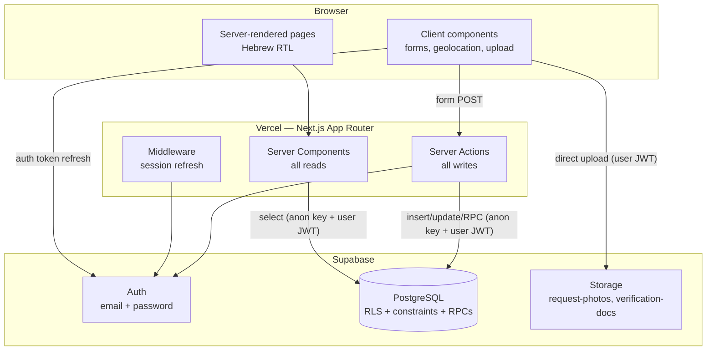
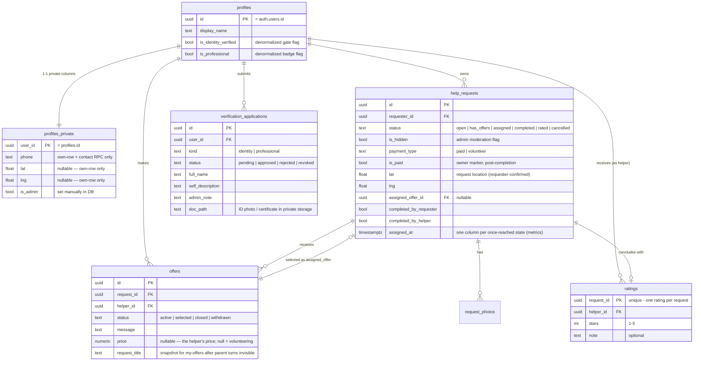
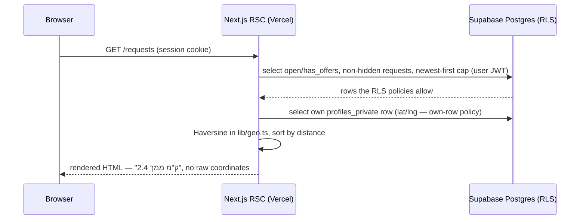
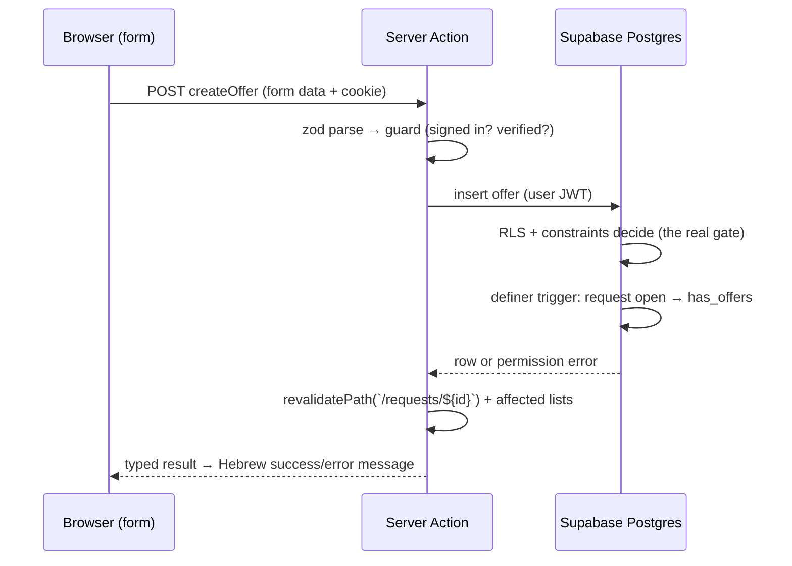

# iHelp — Architecture

**Course:** Internet Technologies — Become a Full-Stack Engineer, RUNI CS 2026
**Document:** 2 of 6 (Architecture, assignment stage 3)
**Depends on:** `01-product-spec.md` (all product rules referenced here are defined there)
**Status:** Draft for review

---

## 1. Overview and Guiding Principles

iHelp is a three-tier application with deliberately few moving parts:

- **Browser** — React UI rendered by Next.js. Hebrew, RTL.
- **Next.js app on Vercel** — server-rendered pages (React Server Components) for
  reads, Server Actions for writes. No separate backend service.
- **Supabase** — PostgreSQL (with Row Level Security), Auth, and Storage.

Principles that shaped every choice below:

1. **The database is the authority.** Every permission in the product spec's §9.2
   matrix is enforced in PostgreSQL (RLS policies, constraints, and a small set of
   SECURITY DEFINER functions). The UI and server code repeat those checks only
   for usability — nothing depends on them for safety.
2. **Smallest possible surface.** One web app, one database, no custom API server,
   no background workers, no queues. Fewer parts to build, test, secure, and
   explain.
3. **Zero fragile dependencies.** No external API beyond Supabase and Vercel — no
   geocoding, no payment gateway, no SMS. Demo day cannot be broken by a
   third-party outage or an expired trial key.
4. **Hebrew RTL UI, English code.** UI copy lives in one Hebrew strings module;
   code, comments, and docs are English.

---

## 2. System Components



**What deliberately does not exist:** a custom Express/API server (Next.js *is*
the backend), a service-role Supabase client in application code (see §9), client
state libraries, realtime subscriptions, background jobs, and any third-party API.

---

## 3. Technology Choices and Why

| Choice | Why |
|---|---|
| **Next.js (App Router)** | Mandated stack. App Router chosen over Pages Router: Server Components make reads server-side by default (data never over-fetched to the client, coordinates can stay on the server — §8.1), Server Actions give type-safe mutations without hand-rolling an API layer, and nested layouts fit the app's shell (nav + RTL direction set once). |
| **TypeScript** | Mandated. One language across UI, actions, and validation schemas. |
| **Supabase** | Mandated. Postgres RLS is the mechanism that makes "the database is the authority" real; Auth and Storage integrate with the same user identity, so one JWT drives DB policies *and* storage policies. |
| **Vercel** | Mandated. Native Next.js hosting; preview deployments per commit help the incremental-commits workflow. |
| **`@supabase/ssr`** | The supported way to use Supabase Auth in App Router: cookie-based sessions readable in Server Components, Server Actions, and middleware. Hand-rolling cookie/session handling around `supabase-js` is exactly the kind of security-sensitive code we should not write ourselves. |
| **Zod** | One schema per form, parsed server-side inside the Server Action as the authoritative gate; client-side, native HTML constraint-validation attributes (`required`, `minLength`, `min`/`max`, `type`) mirror the same rules for instant feedback without shipping a validation runtime to the browser. Single source of truth for input validation (assignment stage 4). |
| **Tailwind CSS** | Utility CSS with **logical properties** (`ms-*`/`me-*`, `text-start`) makes RTL correct by construction instead of by `direction`-specific overrides. No component library — the UI is small enough to own, and it avoids fighting a library's LTR assumptions. |
| **React `useActionState` + plain forms** | Form state and server errors without a form library; the forms here are small (≤ ~8 fields). react-hook-form would be justified only with heavy dynamic forms. |

**Considered and rejected:** Redux/Zustand (server components make the server the
source of truth; there is no cross-page client state), PostGIS (Haversine in
TypeScript is sufficient at city scale — product spec §10), component libraries
(RTL friction, visual sameness), tRPC (Server Actions already provide typed
mutations), Supabase Realtime (product spec excludes push — polling on navigation
suffices).

---

## 4. Database

Full schema with column-level detail, constraints, and every RLS policy comes in
document 3 (technical design). Architecture-level view:

### 4.1 Entities



Notes on the shape:

- **`profiles` is split into a public and a private table — because Postgres RLS
  is row-level, not column-level.** Helper cards and `/helpers/[id]` require every
  signed-in user to read other users' `display_name` and badges, so `profiles`
  necessarily carries a broad SELECT policy. If phone, home coordinates, or `is_admin`
  lived in that same row, any signed-up account could read them with one direct
  PostgREST call — silently defeating the product spec's "phone revealed only
  post-assignment" rule. So `profiles` holds only what is safe to show anyone
  signed in, and `profiles_private` (own-row SELECT/UPDATE only) holds phone,
  lat/lng, and `is_admin`; the contact-reveal RPC and the `is_admin()` helper are
  the only cross-user paths into it.
- **Both rows are created by a trigger on signup.** The
  `is_identity_verified` / `is_professional` flags are denormalized from
  `verification_applications` on approval so that RLS policies and page guards
  check one boolean instead of joining application history. The applications
  table remains the audit trail (product spec §4.1: admins see full history).
- **`request_photos` is a table, not an array column** — photos need per-row
  storage paths and ordering, and a table row per photo maps 1:1 to a storage
  object for cleanup.
- **Status-transition timestamps are columns** (`assigned_at`, `completed_at`,
  `rated_at`, `cancelled_at`, plus `created_at`) rather than a history table:
  every state that matters to the §6 metrics is reached at most once, so one
  column each fully records it. The one cycle in the machine — `open ↔
  has_offers` — is *derived* state whose history is already reconstructible from
  the `offers` table (`created_at`, withdrawn status), so it needs no column and
  no metric asks for one (product spec §7 measurement note).
- **`assigned_offer_id`** on the request plus `status` on the offer is redundant
  on purpose: the request points at the winning offer (fast reads), the offer
  status makes competitor offers self-describing (a helper's "my offers" list
  needs no join through requests).

### 4.2 Database-side logic — the complete privileged-code inventory

A recurring Postgres reality shapes this section: **RLS is row-level.** It cannot
constrain *which columns* an UPDATE changes, compare old and new values, or
authorize writing rows the caller does not own. Every rule with one of those
shapes therefore lives in a small, enumerated set of database functions — most
`SECURITY DEFINER` with an in-body permission check, two trigger functions
deliberately invoker-rights (their mechanism depends on seeing the caller's
role), all with a pinned `search_path`. This section is the complete privileged-
code list the security document audits. Everything else is plain RLS plus
constraints.

**RPCs (called from Server Actions; the write path for every state transition):**

| RPC | What it does (one transaction each) | Why not plain RLS |
|---|---|---|
| `create_request_with_photos(payload, photo_paths[])` | Inserts the request and its photo rows; validates ≥1 path, each inside the caller's own storage folder | Two-table insert must be atomic (supabase-js has no client-side transactions) and "≥1 photo" is a cross-table minimum no CHECK constraint can express |
| `assign_offer(request_id, offer_id)` | Guarded updates: request `has_offers → assigned` + `assigned_at`, chosen offer → *selected* **only if still active**, all competing offers → *closed*; raises (rolls back) if any guard matches zero rows — the row lock serializes a concurrent withdraw | Atomic pivotal moment; closes the withdraw-vs-assign race; RLS cannot authorize the caller to write competitors' offers (spec §7 C6) |
| `confirm_completion(request_id)` | Sets the caller's own completion flag (side derived from caller identity); flips status to *completed* + `completed_at` when both flags true | "Each side sets only its own flag" is an old-vs-new column rule RLS UPDATE policies cannot express (spec §9.2) |
| `cancel_request(request_id)` | Owner + pre-completion check; sets *cancelled* + `cancelled_at`; closes all active — and any selected — offers | Same shape as `assign_offer`: atomic transition + cross-owner offer writes (spec §9.1) |
| `submit_rating(request_id, stars, note)` | Owner + status=*completed* check; inserts the rating and advances the request to *rated* + `rated_at` | The `completed → rated` transition must be atomic with the insert, and no owner UPDATE right could safely flip status |
| `review_application(application_id, verdict, note)` | Admin check; updates the application row and the applicant's profile flags together | Two-table atomic write; and an admin UPDATE policy on `profiles` would (row-level!) grant admins write to *every* profile column including `is_admin` — exactly what spec §4.4 forbids |
| `revoke_verification(user_id, kind)` | Admin check; clears the identity or professional flag (and marks the approval revoked in the audit trail) | Same column-scoping argument as above |
| `set_request_hidden(request_id, hidden)` | Admin check; touches only `is_hidden` | Guarantees moderation "leaves the lifecycle state untouched" (spec §8.6) by construction |
| `mark_paid(request_id)` | Owner check; flips `is_paid` once, post-completion, only when the selected offer carries a price | A second permissive UPDATE policy would OR with the content-edit policy and reopen edits on finished jobs — permissive policies OR their USING/CHECK clauses independently |
| `get_counterpart_contact(request_id)` | Read-only: returns the other party's display name + phone (from `profiles_private`), only to the request owner or selected helper, from *assigned* onward | Column-level conditional exposure — row-level SELECT policies cannot reveal one column to one pair of users per row (spec §8.4) |

**Trigger functions (invisible plumbing, same audit list):**

| Trigger | What it does | Rights model |
|---|---|---|
| On `auth.users` insert | Creates the `profiles` + `profiles_private` rows | SECURITY DEFINER — runs during signup, before any session exists |
| On `offers` insert/status change | Maintains request `open ↔ has_offers` | SECURITY DEFINER — a *helper's* offer insert must update the *requester's* request row; the owner-only UPDATE policy would match zero rows without definer rights |
| Column guard, BEFORE UPDATE on `profiles`, `profiles_private`, `help_requests`, `offers` | Rejects changes to protected columns (verification flags, `is_admin`, request system columns incl. `is_paid`, offer identity columns) coming from role `authenticated` | **Deliberately invoker-rights**: the mechanism *is* "check `current_user`" — the caller's role must be visible; definer RPCs run as the function owner and pass through. `search_path` pinned regardless |
| Offer-insert prep, BEFORE INSERT on `offers` | Normalizes `created_at` and snapshots the request title onto the offer | Invoker-rights — the parent request is visible to the inserter by policy |

**Helpers (SECURITY DEFINER lookups used inside policies):** `is_admin()` (reads
`profiles_private` so the flag never needs to be broadly readable),
`is_identity_verified()` (one-boolean gate checks), and `is_selected_helper()`
(breaks the RLS policy recursion between `help_requests` and `offers` — two
tables whose SELECT policies reference each other would otherwise raise
Postgres's "infinite recursion detected in policy"). One **definer view**,
`helper_ratings`, is the public rating read surface: it exposes stars + note
per helper without the `rater_id`/`request_id` linkage the base table carries —
the column-slicing tool RLS lacks.

**Constraints (plain schema, no privilege needed):** one *active* offer per
helper per request and one *pending/approved* application per user per kind
(partial unique indexes); one rating per request (PK); stars 1–5 (CHECK);
professional application requires already-approved identity (INSERT policy);
offer not on own request (INSERT policy).

---

## 5. Storage

Two private buckets; access via storage RLS policies keyed to the same user JWT:

| Bucket | Contents | Write | Read |
|---|---|---|---|
| `request-photos` | Request images | Any **identity-verified** user, into their own folder (`{user_id}/…`) | Any signed-in user |
| `verification-docs` | ID photos, certificates | Applicant, into their own folder | Applicant + admins only |

Two honest notes on `request-photos`:

- The write rule says *identity-verified user*, not *request owner*, because
  photos are uploaded **before** the request row exists (see §8.3) — at upload
  time there is nothing to own. The verified-only gate (one denormalized boolean)
  keeps unverified accounts from using the bucket as free file hosting; per-object
  size limits and a MIME allowlist bound abuse; orphan cleanup and per-user quota
  are named in the scale document.
- The read rule is *broader than request visibility*: a user who saw a request
  while it was open could keep fetching its photos after an admin hides it,
  because storage policies do not track the parent request's state. This is an
  accepted MVP limitation, parallel to spec §9.3: photo paths are unguessable
  UUIDs, hiding is feed removal (not secrecy), and policy-level tightening is
  listed in the security document.

**Downloads:** both buckets being private, images are rendered via **bulk signed
URLs** created by the Server Component per page (1-hour expiry) — the same
storage policies authorize the signing, and URLs expire instead of living
forever in the HTML.

**Uploads go directly from the browser to Supabase Storage** (authenticated with
the user's JWT), and only the resulting storage path is sent to the Server
Action — which passes it to `create_request_with_photos`, where the DB verifies
each path sits in the caller's own folder and is a real uploaded object. Rationale for direct upload: Server
Actions have a ~1 MB request-body default and Vercel serverless functions cap
payloads around 4.5 MB — proxying multi-megabyte photos through the app server
would hit both limits and double the bandwidth.

---

## 6. Pages

All pages are App Router routes under one RTL Hebrew layout. "Gate" = redirect to
verification flow when the action requires an identity-verified user (product
spec §4.1); the true enforcement is in the DB.

| Route | Purpose | Access |
|---|---|---|
| `/` | Landing → redirects to `/requests` when signed in | Public |
| `/login`, `/signup` | Email/password auth | Public |
| `/requests` | Browse open requests, distance-sorted when location known | Signed-in |
| `/requests/new` | Post a request (photos, category, paid/volunteer, location) | Signed-in + gate |
| `/requests/[id]` | Request detail: offers (owner sees all, helper sees own), offer form, assignment, contact reveal, dual completion, rating | Signed-in (row visibility per RLS) |
| `/my/requests` | My posted requests by status | Signed-in |
| `/my/offers` | My offers and their statuses | Signed-in |
| `/helpers/[id]` | Public helper profile: name, badge, avg rating, rating list | Signed-in |
| `/profile` | Own profile: display name, phone, re-capture location | Signed-in |
| `/verification` | Identity application; professional upgrade; pending/rejected status | Signed-in |
| `/admin` | Verification queue (approve/reject with note) + moderation list (hide/unhide, revoke) | Admin (RLS-backed) |
| `/emergency` | **Static** emergency numbers page, `tel:` links only | Public |

Two route-level mechanisms worth naming:

- **The emergency page is *provably* static** (product spec §11 hard boundary),
  not just static by intention: it sits in the public route group whose layout
  reads no cookies, it is **excluded from the middleware matcher** (no session
  refresh, no Supabase call on its behalf), and it declares
  `export const dynamic = 'force-static'` so any regression to dynamic rendering
  fails the build. The session-aware navigation lives in the signed-in group's
  layout, not the root layout — which is what keeps the root safe for static
  routes.
- **First-login onboarding needs no extra page:** the signed-in group's layout
  redirects any user whose profile has an empty display name to `/profile`,
  which doubles as the onboarding step of spec §8.1 (set name, capture
  location).

---

## 7. Server Actions and RPC Inventory

Every mutation is a Server Action following one pattern:
**zod-validate input → cheap guard (fail fast, friendly Hebrew error) → Supabase
call (RLS/RPC is the real gate) → revalidate the concrete affected paths → typed
result to the form.** (`revalidatePath` is always called with concrete URLs —
`` revalidatePath(`/requests/${id}`) `` plus affected lists like `/requests`,
`/my/offers` — never with a bare dynamic pattern, which Next.js treats as a
literal non-matching URL.)

| Action | Validates | DB effect |
|---|---|---|
| `signUp`, `signIn`, `signOut` | credentials schema | Supabase Auth; profile rows via trigger |
| `updateProfile` | name/phone schema | update own `profiles` + `profiles_private` rows (RLS: own row only) |
| `updateLocation` | lat/lng schema | update own `profiles_private` coordinates (called by the geolocation capture component) |
| `submitIdentityApplication` | application schema | insert `verification_applications` (kind=identity, incl. the phone); on approval `review_application` copies the **reviewed** phone to `profiles_private` (spec §8.2 — the contact-reveal RPC depends on it) |
| `submitProfessionalApplication` | application schema | insert `verification_applications` (kind=professional; INSERT policy requires approved identity) |
| `createRequest` | request schema (≥1 photo path) | **RPC `create_request_with_photos`** |
| `updateRequest` | request schema | update own request — content columns only (RLS: owner + status ∈ {open, has_offers}; system columns trigger-guarded) |
| `cancelRequest` | id | **RPC `cancel_request`** |
| `markPaid` | id | **RPC `mark_paid`** |
| `createOffer` | offer schema | insert `offers` (RLS: identity-verified, not own request; partial unique index blocks duplicate active) |
| `updateOffer`, `withdrawOffer` | offer schema / id | update own active offer (RLS) |
| `assignOffer` | ids | **RPC `assign_offer`** |
| `confirmCompletion` | id | **RPC `confirm_completion`** |
| `submitRating` | stars/note schema | **RPC `submit_rating`** |
| `approveApplication`, `rejectApplication` | id + note | **RPC `review_application`** |
| `hideRequest`, `unhideRequest` | id | **RPC `set_request_hidden`** |
| `revokeVerification` | user id + kind | **RPC `revoke_verification`** |

Reads never go through actions: Server Components query Supabase directly and the
contact reveal uses `get_counterpart_contact` (the only read RPC).

**No REST/route-handler API layer exists.** With password-only auth and email
confirmation disabled (§8.4), even the classic `/auth/callback` code-exchange
route is unnecessary — `@supabase/ssr` sets the session cookies directly from the
sign-in/sign-up Server Actions; the callback route appears only when email
confirmation is switched on (the stated roadmap item). Rationale: Server Actions
cover every mutation with less surface (no endpoint enumeration, origin checks
built in), and no third party needs to call iHelp programmatically.

---

## 8. Data Flow

### 8.1 Read path — browsing requests (distance sorting stays on the server)



Distance is computed **in the Server Component**, so the browsing UI never
receives raw coordinates of other users — only formatted distances. (Request
coordinates remain *queryable* by a signed-in API caller under MVP RLS — the
accepted limitation of spec §9.3; profile home coordinates are **not**, thanks to
the `profiles_private` split of §4.1.)

**Distance sorting vs pagination — the explicit MVP resolution:** the database
cannot `ORDER BY` a distance computed in application code, so the RSC fetches
open requests with a hard newest-first cap (e.g., 200 rows — an order of
magnitude above the spec's MVP scale), Haversine-sorts in memory, and paginates
the sorted array server-side. When the cap becomes visible, the successor is
DB-side distance (SQL Haversine expression with keyset pagination) — named in
the scale document. This trades a bounded, well-understood limit for zero
geo-infrastructure now.

### 8.2 Write path — making an offer



### 8.3 Upload path — request photos

Browser validates size/type → uploads directly to `request-photos` bucket with
the user JWT (storage policy: identity-verified, own folder only) → receives
storage paths → submits the form → `create_request_with_photos` inserts request
+ photo rows atomically and re-verifies each path is in the caller's folder.
Failed submissions leave orphaned storage objects at worst (bounded by size
limits; cleanup noted in the scale doc) — never a photo-less published request.

### 8.4 Auth/session flow

Middleware runs on every request and refreshes the Supabase session cookie if
expired (`@supabase/ssr` pattern). Server Components and Server Actions construct
a per-request Supabase client from cookies; the user's JWT rides every DB and
storage call, which is what makes RLS decisions per-user. Email confirmation is
disabled for the MVP — signup works instantly on demo day with no SMTP
configuration; enabling it is a one-switch roadmap item.

---

## 9. Users, Permissions, and Enforcement Layers

### 9.1 Who exists in the system

One account type; capability tiers are unlocked by flags, and within a tier
permissions are per-row (full matrix: product spec §9.2):

| User class | May do |
|---|---|
| Anonymous visitor | Landing, login/signup, emergency page |
| Signed-in, unverified | Browse requests and helper profiles; apply for identity verification; edit own profile |
| Identity-verified | + Post/edit/cancel own requests, offer on others' requests, assign, dual-complete, rate, mark paid, see assigned counterpart's contact |
| + Professional badge | Same capabilities; a reviewed credential badge shown beside their offers |
| Admin (`is_admin` in `profiles_private`) | + Review verification applications, hide/unhide requests, revoke verifications — via the admin RPCs only, never blanket table access |

### 9.2 Enforcement in depth

The product spec §9.2 matrix is enforced in depth — each layer catches what the
one above misses, and only the last one is trusted:

1. **Middleware** — session refresh only; redirects signed-out users from
   app pages to `/login`. No authorization logic.
2. **UI** — hides/disables what the user cannot do (no offer form on your own
   request, no admin nav for non-admins). Usability only.
3. **Server Action guards** — zod validation + fast permission pre-checks for
   friendly Hebrew errors. Convenience only.
4. **Database** — RLS policies (per-row, per-action), unique/check constraints,
   and the enumerated privileged-code inventory of §4.2 (ten RPCs, four trigger
   functions, three policy helpers, one definer view — each with in-body
   permission checks where applicable). **This layer is the authority**; a
   crafted request that skips layers 1–3 still hits it with nothing but the
   caller's own JWT.

**The service-role key is used by zero lines of application code.** Everything the
app does — including admin actions — runs as the signed-in user through RLS
(admin policies check the caller's `is_admin` via a SQL helper). The service key
exists only in local tooling for migrations/seeding. Consequence: leaking the
deployed app's env vars (`NEXT_PUBLIC_SUPABASE_URL`, `NEXT_PUBLIC_SUPABASE_ANON_KEY`)
grants an attacker nothing beyond what any signed-up user already has.

---

## 10. State, Validation, and Error Handling

- **Client state is minimal by design:** URL is the state for lists/filters;
  forms hold local state via `useActionState`; the only browser-API state is the
  one-time geolocation capture. Everything else is fetched fresh by Server
  Components and revalidated after mutations — no client cache to invalidate, no
  global store.
- **Validation:** one zod schema per form in `lib/validation/`, parsed
  authoritatively in the Server Action; client components mirror the same rules
  with native HTML constraint-validation attributes. DB constraints back the
  same rules at the last line of defense.
- **Error handling:**
  - Server Actions return a typed `{ ok, fieldErrors?, formError? }` result;
    forms render Hebrew messages next to fields.
  - Permission denials arrive in two shapes and both map to one generic Hebrew
    "אין הרשאה" message: WITH CHECK/constraint/RPC violations raise Postgres
    errors, while rows filtered by an UPDATE policy's USING clause are
    *silently skipped* (zero affected rows, no error) — so every direct update
    chains `.select()` and treats an empty result as a denial.
  - `error.tsx` boundaries per route group catch render failures;
    `not-found.tsx` covers missing/unauthorized rows (RLS makes them
    indistinguishable — deliberately).
  - Geolocation denial is a normal state, not an error: lists render unsorted
    with a hint to enable location.

---

## 11. Folder Structure

```
app/
  (public)/            # login, signup, emergency, landing — layout reads no cookies
  (app)/               # signed-in shell: requests, my/*, profile, helpers,
                       # verification, admin — admin shares the shell's nav and
                       # error boundary; RLS + an in-page is_admin gate protect it
  layout.tsx           # html dir="rtl" lang="he" only — nav lives in (app) layout
                       # note: no auth/callback route — password auth with email
                       # confirmation off needs none; it appears with that roadmap item
lib/
  supabase/server.ts   # per-request server client (cookies)
  supabase/client.ts   # browser client (auth, storage upload)
  supabase/middleware.ts
  geo.ts               # Haversine + distance formatting
  validation/          # zod schemas, shared client/server
  strings.ts           # all Hebrew UI copy in one module
components/            # form fields, request card, badge, stars, etc.
actions/               # server actions grouped by domain
supabase/
  migrations/          # SQL: schema, RLS, RPCs, triggers, storage policies
docs/                  # the six submission documents
```

---

## 12. Deployment Topology and Environment

- **Vercel project** ← GitHub repo (`main` = production; previews per PR).
- **Supabase project** (single production instance for the course; local
  `supabase start` for development).
- **App environment variables — exactly two, both public by design:**
  `NEXT_PUBLIC_SUPABASE_URL`, `NEXT_PUBLIC_SUPABASE_ANON_KEY`. The anon key is
  safe to expose *because* RLS is the authority (§9). The service-role key is
  not configured on Vercel at all. (Full env-var list incl. local tooling: the
  scale/security documents.)
- Migrations are SQL files in-repo, applied via Supabase CLI — the database
  schema has the same review/commit history as the code.

---

## 13. What This Architecture Deliberately Avoids

| Avoided | Because |
|---|---|
| Custom API/backend service | Server Actions + RLS cover every use case with far less surface |
| Service-role key in app code | One compromised deployment would otherwise bypass every policy (§9) |
| Client state library / client cache | Server Components make staleness and invalidation a non-problem at this scale |
| Realtime subscriptions | Product excludes push; navigation-time freshness suffices (spec §10) |
| Proxying file uploads through the server | Body-size limits + double bandwidth (§5) |
| PostGIS / geo services | Haversine in ~15 lines of TypeScript at city scale (spec §10) |
| ORM (Prisma/Drizzle) | Supabase client + SQL migrations keep the RLS/RPC layer front and center — the ORM would hide exactly the layer this project is graded on understanding |
