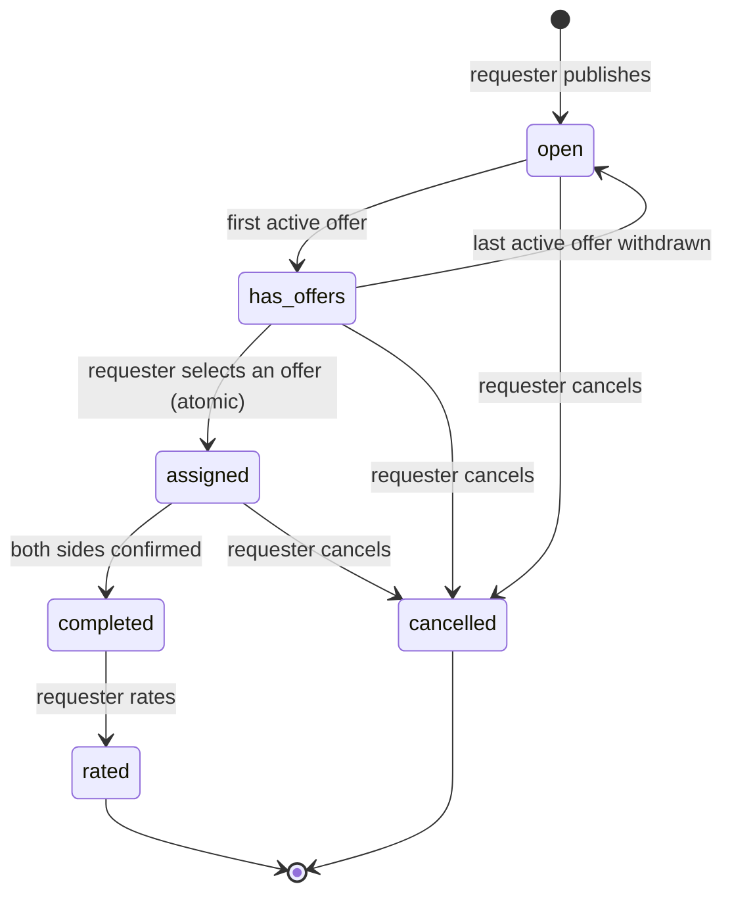

# iHelp — מפרט מוצר

**קורס:** טכנולוגיות אינטרנט — Become a Full-Stack Engineer, מדעי המחשב אוניברסיטת רייכמן 2026
**מסמך:** 1 מתוך 11 (מפרט מוצר, שלב 2 של המטלה)
**סטטוס:** סופי
**שפת הממשק:** עברית (RTL) · **קוד ותיעוד:** אנגלית

---

## 1. תקציר מנהלים

iHelp הוא שוק עזרה מקומי אשר **הופך את מודל החיפוש**. במקום שאדם הזקוק לעזרה יחפש בעל מקצוע (יעיין ברשימות, יתקשר לכל עבר, ימתין לשיחות חוזרות), האדם **מפרסם בקשת עזרה** ועוזרים מאומתים בקרבתו **מתחרים על ההצעה לעזור** — בתשלום או בהתנדבות. עם השלמת העזרה, שני הצדדים מאשרים את סיומה והמבקש מדרג את העוזר.

ההיפוך מקצר את הדרך אל העזרה: הביקוש מתפרסם פעם אחת וההיצע מגיע אליו, במקום שהביקוש ירדוף אחר ההיצע שיחת טלפון אחר שיחת טלפון. האמון הוא סימטרי מעצם התכנון — כל משתמש שמבצע עסקה, מבקש או עוזר, עובר אימות זהות בבדיקת מנהל לפני העסקה הראשונה שלו.

**עקרון ה-MVP:** קטן, נקי, עובד, ומאובטח. ה-MVP מממש את מלוא לולאת הליבה (פרסום ← הצעה ← שיבוץ ← השלמה ← דירוג) יחד עם אימות, דירוגים, עיון מודע-מרחק ותפקיד מנהל — ובמכוון שום דבר מעבר לכך.

---

## 2. הבעיה

מציאת עזרה אמינה וזמינה במהירות היא משימה קשה:

1. **הגילוי איטי וחד-כיווני.** האדם שזקוק לעזרה חייב לחפש, להשוות וליצור קשר עם ספקים אחד-אחד. הספקים אינם רואים את הביקוש אלא אם פונים אליהם ישירות.
2. **בניית אמון היא יקרה — והיא חייבת לפעול בשני הכיוונים.** כל אחד יכול לטעון שהוא חשמלאי; ביקורות מפוזרות בין פלטפורמות שונות; הסמכות כמעט אף פעם אינן נבדקות בשום מקום. לבעיה המראתית ניתנת עוד פחות תשומת לב: עוזר המשיב לבקשה של אדם זר נכנס לבית לא מוכר. פלטפורמה שמאמתת צד אחד בלבד משאירה את הצד השני חשוף.
3. **הזמינות אינה שקופה.** המבקש אינו יכול לדעת מי באמת פנוי ונמצא בקרבתו *ברגע זה*; הספקים אינם יכולים לראות אילו בקשות בקרבתם פתוחות.
4. **משימות קטנות ומתאימות להתנדבות נופלות בין הכיסאות.** משימות קטנות מכדי להזמין עבורן שירות עסקי (סחיבת רהיטים במדרגות, עזרה במילוי טופס, הסעה למרפאה) פעמים רבות יש להן שכנים מוכנים לעזור — אך אין ערוץ שמחבר ביניהם.

**מי חש בכאב הזה:** משקי בית הזקוקים לתיקונים או לסידורים; קשישים ובני משפחותיהם; תושבים חדשים באזור ללא רשת קשרים מקומית; בעלי מקצוע ושכנים המוכנים לעזור, שיש להם זמן פנוי אך אין להם נראוּת לביקוש שבקרבתם.

---

## 3. הפתרון

iHelp הופך את השוק:

- **מבקש** מפרסם בקשת עזרה: כותרת, תיאור, קטגוריה, ואופציונלית תצלום אחד או יותר (עד 5), ומיקום — **ללא בחירת תשלום/תמחור**. בקשה היא פשוט תיאור של מה שנדרש. **התמחור הוא כולו של העוזר**: כל הצעה מצהירה על אחת משלוש עמדות — **מחיר קבוע** עכשיו, **התנדבות** (חינם), או **"המחיר ייקבע לאחר העבודה"** (עבודות רבות, כמו של שרברב או חשמלאי, לא ניתן לתמחר לפני שהעוזר רואה את הבעיה; הסכום הסופי מוזן לאחר שהעבודה הושלמה). כל בקשה מקבלת את שלושתן.
- **עוזרים מאומתים** מעיינים בבקשות פתוחות — ממוינות לפי המרחק מהם — ומגישים הצעות המתארות כיצד יעזרו ובאיזה מחיר — או בחינם.
- המבקש משווה בין ההצעות (פרופיל העוזר, תג האימות, דירוג ממוצע, **מחיר**, הודעת ההצעה) ו**בוחר אחת**. כל ההצעות האחרות נסגרות אוטומטית באותו רגע. העוזרים מתחרים על אמון, מהירות, *ו*מחיר.
- לאחר שהעבודה הושלמה, **שני הצדדים מאשרים את סיומה**, והמבקש מדרג את העוזר (1–5 כוכבים בתוספת הערה אופציונלית). הדירוגים מצטברים בפרופיל הציבורי של העוזר ובונים את שכבת האמון של הפלטפורמה.

האמון נבנה משני מנגנונים בלתי-תלויים:

1. **אימות זהות לפני כל עסקה — בשני הצדדים.** משתמש חייב לעבור אימות זהות בבדיקת מנהל לפני פרסום בקשה *או* הגשת הצעה (ראה §4.1). בקשות מזמנות אנשים אמיתיים למקומות אמיתיים: מבקש זדוני יכול להשתמש בבקשה מזויפת כדי לפתות עוזר, בדיוק כשם שעוזר זדוני יכול לנצל את ביתו של מבקש. אימות של צד אחד בלבד היה משאיר את הצד השני חשוף, ולכן iHelp חוסם את שני הצדדים. בעלי מקצוע יכולים להוסיף על כך הסמכה שנבדקה (ראה §4.3). תוצאה מועילה: עד לרגע שבו מספרי הטלפון נחשפים הדדית בעת השיבוץ (§8.4), **שני** הצדדים כבר עברו בדיקת מנהל.
2. **דירוגים לאחר כל עבודה.** המוניטין מצטבר בכל בקשה שהושלמה.

### מה iHelp במכוון אינו (MVP)

- **אינו פלטפורמת תשלומים.** אין כסף העובר דרך המערכת. המחיר של *ההצעה הנבחרת* (קבוע, או שנקבע על ידי העוזר לאחר העבודה) נישא כנתון בלבד; לאחר ההשלמה יכול המבקש לסמן תיבת "שולם" לצורכי תיעוד. הנימוק: שער תשלום אמיתי מוסיף תלות חיצונית שברירית ובתשלום, וכן היקף רגולציה כבד ללא ערך למידה עבור ה-MVP; מנגנוני השוק הם המוצר.
- **אינו שירות חירום.** דף מידע סטטי מציג מספרי חירום ישראליים אמיתיים כקישורי טלפון פשוטים. ראה §11 — זהו גבול נוקשה.
- **אינו אפליקציית צ'אט.** תיאום מעבר להודעת ההצעה (כתובת מדויקת, תזמון) מתרחש מחוץ לפלטפורמה ב-MVP; מספרי הטלפון נחשפים הדדית לאחר השיבוץ (ראה §8.4). צ'אט מינימלי בתוך האפליקציה הוא תוספת אפשרית לאחר ה-MVP.

---

## 4. משתמשים ותפקידים

**חשבון אחד, כמה כובעים.** ל-iHelp יש סוג חשבון יחיד. אותו אדם יכול לפרסם בקשה בבוקר ולהציע עזרה בבקשה של מישהו אחר אחר הצהריים. ההרשאות מוצמדות אפוא ל**שורות, לא לחשבונות**: מה שמותר לך לעשות עם בקשה, הצעה או דירוג ספציפיים תלוי ביחסך לאותה שורה (בעלים, מציע, משובץ), ונאכף ברמת מסד הנתונים באמצעות Row Level Security (RLS). הדגלים היחידים ברמת החשבון הם סטטוס אימות הזהות, סטטוס ההסמכה המקצועית, ודגל המנהל.

### 4.1 אימות זהות — שער העסקה

הרשמה כשלעצמה מאפשרת עיון בלבד. לפני שמשתמש יכול **לפרסם בקשה או להגיש הצעה**, עליו לעבור אימות זהות: הוא מגיש את שמו המלא, מספר טלפון, ותיאור עצמי קצר, ואופציונלית תצלום תעודת זהות (מאוחסן באופן פרטי, נראה רק למגיש ולמנהלים), ומנהל מאשר או דוחה ידנית את הבקשה בצירוף הערה. משתמשים שנדחו רשאים להגיש בקשה מחדש; המנהל הבודק תמיד רואה את מלוא היסטוריית הבקשות, כולל הערות דחייה קודמות, כך שהגשה חוזרת של אותו תוכן אינה זוכה בהטלת קוביות חדשה. אין תקופת המתנה להגשה מחדש ב-MVP — פשטות מקובלת, המוגבלת בכלל שלפיו רק בקשה אחת מכל סוג יכולה להיות ממתינה בכל רגע (§9.2).

מדוע שני הצדדים, ולא רק העוזרים: כל עסקה מסתיימת בשני זרים הנפגשים בעולם הפיזי, בדרך כלל בביתו של המבקש. *עוזר* זדוני מאיים על המבקש — אך *מבקש* זדוני יכול באותה קלות להשתמש בבקשה מפוברקת כדי לפתות עוזר לכתובת מסוימת. השער הוא אפוא סימטרי: אף אחד אינו מזמן אדם, ואף אחד אינו נענה לזימון, מבלי שעבר קודם בדיקה אנושית.

ה-MVP משתמש ב**אישור מנהל ידני** — ללא שירות זהות/KYC חיצוני או שירות SMS — ובכך שומר על פריסה נקייה מתלויות חיצוניות שבריריות, תוך שהוא עדיין מציב שער אנושי לפני כל עסקה. זהו במודע חלש יותר מהוכחת זהות ברמה ממשלתית; המגבלה מתועדת בגלוי (§14) ואימות חזק יותר נמצא במפת הדרכים של מסמך האבטחה.

מה הבדיקה באמת בודקת — ומה אין ביכולתה: המנהל בודק שלמות וקוהרנטיות (שם מלא סביר, תיאור עצמי הגיוני, והתאמת שם כאשר סופק תצלום תעודת זהות); בקשות חלקיות, לא סבירות או פוגעניות נדחות. מספר הטלפון **אינו** מאומת ב-MVP — SMS OTP היה מחזיר שירות חיצוני בתשלום — ולכן הוא מטופל כנתון תיאום, לא כראיית זהות; אימות SMS הוא פריט מוזכר במפת הדרכים במסמך האבטחה. דרישת תצלום תעודת הזהות נשקלה ונדחתה: בקנה המידה של ה-MVP המנהל יכול פשוט לדחות בקשות שנראות דלות בלעדיו.

בעוד שבקשה ממתינה, דף האימות מציג סטטוס *ממתין לבדיקה* גלוי. אין התראות ב-MVP (§10), ולכן האישור מתגלה בביקורו הבא של המגיש — חיכוך מקובל, המוגבל בזמן הטיפול בבדיקה: בקנה המידה של ה-MVP (עשרות משתמשים, אזור פיילוט אחד) מצופה שהמנהלים יבדקו תוך שעות, ו-§14 מציין את התור כצוואר הבקבוק האנושי של המערכת.

תצלומי תעודת הזהות נשמרים כל עוד החשבון נשאר מאומת — הם מסלול הביקורת (audit trail) שמאחורי האישור וכל החלטת שלילה מאוחרת יותר; מגבלות שמירה ומחיקה מפורטות במסמך האבטחה, במקביל לטיפול בנתוני מיקום ב-§9.3.

### 4.2 מבקש (כל משתמש מאומת-זהות)

כל משתמש מאומת-זהות רשאי לפרסם בקשות עזרה. מבקש יכול:

- לפרסם, לערוך ולבטל את בקשותיו שלו;
- לצפות בכל ההצעות על בקשותיו שלו ולבחור אחת;
- לאשר השלמה מצדו;
- לדרג את העוזר לאחר ההשלמה (פעם אחת לכל בקשה);
- לסמן בקשה כשולמה כאשר ההצעה הנבחרת נושאת מחיר (לצורכי תיעוד בלבד).

### 4.3 עוזר (כל משתמש מאומת-זהות; הסמכה מקצועית אופציונלית)

כל משתמש מאומת-זהות רשאי להגיש הצעות — שער הזהות של §4.1 הוא תנאי מקדים לאמון, והוא כבר נעבר. מעבר לכך, עוזר יכול להגיש בקשה ל**הסמכה מקצועית**:

| תג | למי הוא מיועד | הוכחה | אישור |
|---|---|---|---|
| **מאומת** (בסיסי) | כל משתמש מאומת-זהות | בקשת הזהות של §4.1 | מנהל (כבר הוענק) |
| **מקצועי** (תוספת) | מקצועות ובעלי מלאכה מורשים/מוסמכים | מסמך תעודה/רישיון שהועלה לאחסון פרטי | המנהל בודק את המסמך ומאשר או דוחה בצירוף הערה |

התג המקצועי אינו משנה דבר לגבי *מה* שעוזר רשאי לעשות — ההצעות, ההשלמה והדירוגים פועלים באופן זהה — הוא משנה מה שהמבקש *רואה* בעת השוואת ההצעות: הסמכה שנבדקה לצד ההצעה. איתות מיומנות מונח על גבי אמון הזהות, לא תחליף לו.

עוזר יכול:

- לעיין בבקשות פתוחות, ממוינות לפי מרחק כאשר המיקום זמין;
- להגיש הצעה אחת לכל בקשה, ולערוך או למשוך אותה בעודה פעילה. הצעה יחידה הניתנת לעריכה שומרת על תצוגת ההשוואה של המבקש נקייה (שורה אחת לכל עוזר), מונעת ספאם הצעות ותחרות עצמית, והעריכה מכסה את המקרה של "אני רוצה לעדכן את התנאים שלי" ללא שורות נוספות;
- לראות רק את הצעותיו שלו על בקשות של אחרים — לעולם לא של המתחרים. ההצעות הן במכרז סגור (sealed-bid) בכוונה: הסתרת תנאי המתחרים מונעת מרוץ אל התחתית במחיר ומגנה על פרטיות התמחור של העוזרים, בעוד שהמבקש עדיין משווה את כל ההצעות זו לצד זו. הדבר גם שומר על כלל הגישה פשוט: הצעה קריאה רק לבעליה ולבעל הבקשה;
- לאשר השלמה מצדו לאחר שיבוצו.

לעוזרים יש פרופיל ציבורי: שם תצוגה, תג (מאומת / מקצועי), דירוג ממוצע, ומספר הדירוגים.

### 4.4 מנהל

קבוצה קטנה ומהימנה של חשבונות המסומנים כמנהל (בוליאני בפרופיל, המוגדר ידנית במסד הנתונים — במכוון פשוט וניתן לביקורת בקנה המידה של ה-MVP). מנהלים:

- בודקים ומאשרים/דוחים בקשות אימות משני הסוגים — זהות (§4.1) והסמכה מקצועית (§4.3) — כולל צפייה בתצלומי תעודת זהות ובתעודות המאוחסנים באופן פרטי;
- מבצעים ניהול בסיסי (moderation): הסתרת בקשה פוגענית מהעיון, או שלילת אימות של משתמש — לפי סוג: שלילת אימות **זהות** מסירה את הזכות לפרסם בקשות ולהגיש הצעות כאחד (עבודה שכבר בתהליך אינה מושפעת); שלילת ההסמכה **המקצועית** מסירה רק את התג.

מנהלים **אינם** מקבלים גישת כתיבה גורפת לתוכן המשתמשים; יכולותיהם תחומות לפעולות הניהול לעיל ונאכפות באותו מנגנון RLS ככל דבר אחר.

---

## 5. הלקוח

משתמשים ולקוחות הם ישויות נבדלות:

- **משתמשים** הם מבקשים ועוזרים (§4).
- **הלקוח** — הצד שממנו העסק מפיק בסופו של דבר את הכנסתו — הוא **העוזר המקצועי**. iHelp הוא, מבחינה כלכלית, ערוץ ליצירת לידים: הוא מספק לבעלי המקצוע ביקוש קרוב, מפורש ומוכן-לרכישה. שווקים דומים מפיקים הכנסה בדיוק מצד זה (דמי ליד, מנויים, או עמלה לכל עבודה בתשלום שהושלמה).
- מבקשים במכוון **לעולם אינם מחויבים בתשלום** — חיוב צד הביקוש היה מדכא את הנזילות שהופכת את הפלטפורמה ליקרת ערך עבור צד ההיצע. אימות הזהות (§4.1) אמנם מטיל עלות חד-פעמית ו*לא-כספית* על אותו צד ביקוש עצמו; השניים הם עסקאות שונות במכוון. השער קונה בטיחות — בלעדיו עוזרים ניצבים בפני סיכון פיזי אמיתי — והוא משולם פעם אחת, בעוד שחיוב היה מכס חוזר ללא תמורת אמון. עם זאת, עדיין מצופה שהשער יעלה בהמרה מסוימת של צד הביקוש, ומדד השלמת האימות G2 של §6 קיים בדיוק כדי לפקח על מחיר זה.
- פעילות ההתנדבות אינה ממומנת. היא קיימת מפני שהיא מניעה אימוץ, צפיפות ורצון טוב — כל אלה מגדילים את ערך הצד בתשלום.

ב-MVP אף אחד אינו מחויב בתשלום; תפקידו של ה-MVP הוא לתקף את המנגנונים ואת הביקוש (ראה §6).

---

## 6. יעדים עסקיים

1. **תיקוף מנגנון השוק ההפוך.** ההשערה היא שפרסום בקשה מביא עזרה במאמץ פחות מחיפוש יזום. ה-MVP מודד את הצד שלו ביעדים מוחלטים: **זמן חציוני עד ההצעה הראשונה** ושיעור הבקשות המקבלות ≥1 הצעה תוך 24 שעות. (למשך חיפוש יזום אין בסיס-השוואה בתוך המוצר, ולכן "מהיר יותר מחיפוש" נשאר השערה שמדדים אלה תומכים בה ולא טענה שהם מוכיחים.)
2. **בניית שכבת אמון שמצטברת — בשני הצדדים.** אימות זהות לפני כל עסקה (מבקש או עוזר), הסמכה מקצועית אופציונלית שנבדקה, ודירוג לאחר כל השלמה. מדדים: שיעור המשתמשים הרשומים המשלימים אימות זהות, שיעור העוזרים המחזיקים בתג המקצועי, דירוג ממוצע, שיעור הבקשות שהושלמו שקיבלו דירוג.
3. **השגת נזילות מקומית.** המוצר שימושי רק במקום שבו מספיק עוזרים רואים מספיק בקשות. עיון ממוין-מרחק מרכז את תשומת הלב באופן מקומי. מדד: שיעור השלמה (משובץ ← הושלם) בתוך אזור פיילוט.
4. **יצירת משטח המונטיזציה העתידי.** עמדות התמחור לכל הצעה (קבוע / התנדבות / מחיר-לאחר-העבודה), מחירי ההצעות המוסכמים, ותיבת סימון-שולם רושמים בדיוק את הנתונים (נפח וערך העבודות בתשלום לכל קטגוריה/אזור) הדרושים לתמחור דמי ליד או עמלות בהמשך — מבלי להפעיל תשלומים כעת.
5. **שירות הקהילה.** ההתנדבות היא אזרחית ממדרגה ראשונה, לא מקרה שולי: כל הצעה יכולה להיות הצעת התנדבות, על כל בקשה. הדבר מרחיב את האימוץ מעבר לעסקאות מסחריות והוא התרומה החברתית של המוצר.

---

## 7. יכולות מוצר נדרשות

יכולות שהתוכנה חייבת לספק כדי לאפשר את היעדים לעיל, וסיבתן:

| # | יכולת | מאפשרת (יעד §) |
|---|---|---|
| C1 | הרשמת חשבון, התחברות, וניהול session | הכול — הזהות עומדת בבסיס כל הרשאה |
| C2 | פרופיל משתמש עם שם תצוגה, מספר טלפון, ומיקום מאוחסן (lat/lng הנלכד באמצעות ה-geolocation API של הדפדפן, בהסכמת המשתמש) | G1, G3 — מיון מרחק; מספר הטלפון הוא ערוץ התיאום שלאחר השיבוץ (§8.4) |
| C3 | יצירת בקשת עזרה (למשתמשים מאומתי-זהות בלבד) עם כותרת, תיאור, קטגוריה, תצלומים אופציונליים (0–5, מועלים לאחסון), ומיקום — ללא בחירת תשלום (התמחור הוא של העוזר, לכל הצעה) | G1, G2, G4 |
| C4 | עיון בבקשות עבור עוזרים: בקשות פתוחות ממוינות לפי מרחק (מחושב בקוד היישום בעזרת נוסחת Haversine — ללא שירות geocoding/מפות חיצוני); נפילה חיננית (graceful fallback) לרשימה לא-ממוינת כאשר המשתמש דוחה את הרשאת המיקום | G1, G3 |
| C5 | הגשה, עריכה ומשיכה של הצעות על ידי משתמשים מאומתי-זהות; נראות ההצעה מוגבלת לבעל ההצעה ולבעל הבקשה | G1, G2 |
| C6 | בחירת הצעה אטומית: בחירת הצעה אחת משבצת את הבקשה וסוגרת את כל ההצעות המתחרות בעסקה יחידה (ללא מצבי ביניים חלקיים הנראים למשתמשים) | G1 — הרגע המכריע של השוק חייב להיות אמין |
| C7 | השלמה דו-צדדית: כל צד מאשר באופן עצמאי; הבקשה הופכת ל-*completed* רק כאשר שני הצדדים אישרו | G2 — מונע סגירה חד-צדדית של עבודה שנויה במחלוקת |
| C8 | דירוג: המבקש מדרג את העוזר פעם אחת לכל בקשה שהושלמה (1–5 כוכבים + הערה אופציונלית); פרופילי העוזרים מציגים ממוצע וספירה | G2 |
| C9 | תהליך אימות דו-סוגי — בקשות זהות (נדרשות כדי לבצע עסקה) ובקשות הסמכה מקצועית — עם העלאות לאחסון פרטי ותור בדיקת מנהל (אישור/דחייה + הערה) | G2 |
| C10 | ניהול מנהל: הסתרת בקשה מהעיון, שלילת אימות | G2 — אמון דורש מנגנון תיקון |
| C11 | תיבת סימון-שולם על בקשות שהושלמו שהצעתן הנבחרת נושאת מחיר | G4 |
| C12 | אכיפת הרשאות ברמת מסד הנתונים לכל יכולת לעיל — מדיניות RLS, בתוספת אילוצי unique/check ופונקציות SECURITY DEFINER בעלות היקף צר במקום שבו כלל משתרע על פני שורות או חייב להיות אטומי | הכול — טענות אמון הן ריקות אם שכבת הנתונים אינה אוכפת אותן |
| C13 | דף משאבי חירום סטטי (ראה §11) | חובת זהירות; במכוון **אינה** יכולת עסקית |

הערת מדידה: הסכימה רושמת חותמות זמן של יצירה וכל מעבר סטטוס, ולכן כל מדדי §6 ניתנים לחישוב ב-SQL ישיר. ממשק דו"חות/אנליטיקה בתוך האפליקציה נמצא במכוון מחוץ להיקף (§10).

מחוץ להיקף עבור ה-MVP (במכוון): תשלומים אמיתיים, העלאת וידאו, צ'אט בתוך האפליקציה, התראות, ממשקי geocoding/חיפוש-כתובות, PostGIS (מפת Leaflet + OpenStreetMap להצגה-בלבד כלולה — ראה §10). כל אחד מהם הוא או תלות חיצונית שברירית/בתשלום או היקף שאינו בוחן את מנגנון הליבה.

---

## 8. תהליכי משתמש מרכזיים

### 8.1 הרשמה, התחברות, ופרופיל

1. מבקר נרשם עם דוא"ל + סיסמה ומקבל חשבון.
2. בהתחברות הראשונה המשתמש קובע שם תצוגה ומתבקש (בהנחיית הרשאת דפדפן) לשתף את מיקומו; אם ניתנה הרשאה, lat/lng נשמר בפרופיל שלו. דחיית שיתוף המיקום נתמכת באופן מלא — האפליקציה אז מציגה רשימות לא-ממוינות (C4). מספר הטלפון נלכד מאוחר יותר, כחלק מאימות הזהות (§8.2) — הוא משמש אך ורק לתיאום שלאחר השיבוץ, ו-§8.4/§9.3 מגדירים בדיוק מתי הוא נחשף.
3. המשתמש יכול לעדכן את פרופילו וללכוד מחדש את מיקומו בכל עת. הדבר כולל את מספר הטלפון: הוא נתון תיאום, לא ראיית זהות שנבדקה (§4.1 — ה-MVP אינו מאמת אותו בכל מקרה), ולכן עריכתו אינה מפעילה אימות מחדש.

### 8.2 קבלת אימות — זהות תחילה, הסמכה אופציונלית

1. כל משתמש רשום פותח את "אימות חשבון" ומגיש את בקשת הזהות (§4.1): שם מלא, מספר טלפון (נשמר לפרופיל), תיאור עצמי קצר, ואופציונלית תצלום תעודת זהות (מאוחסן באופן פרטי, נראה רק למגיש ולמנהלים).
2. הבקשה נכנסת לתור בדיקת המנהל בסטטוס *pending*. מנהל מאשר — המשתמש רשאי כעת לפרסם בקשות ולהגיש הצעות — או דוחה בצירוף הערה (המשתמש רשאי להגיש בקשה מחדש).
3. משתמש מאומת-זהות רשאי בנוסף להגיש בקשה ל**תג המקצועי** על ידי העלאת קובץ תעודה/רישיון (אותו אחסון פרטי, אותו תהליך בדיקה). האישור מוסיף את התג המוצג לצד הצעותיו; הדחייה משאירה אותו עוזר מאומת, לא-מקצועי.

### 8.3 פרסום וניהול בקשת עזרה (מבקש)

הפרסום דורש אימות זהות (§4.1); משתמש לא מאומת מופנה לתהליך האימות של §8.2.

1. המבקש ממלא כותרת, תיאור, קטגוריה, אופציונלית מעלה עד 5 תצלומים, ומאשר את מיקום הבקשה (ברירת מחדל היא מיקום הפרופיל). התצלומים מומלצים אך אינם חובה: הם מעלים את איכות הבקשה ואת מהימנותה, מרתיעים ספאם ופרסומים ברמת מאמץ נמוכה, ומאפשרים לעוזרים להעריך את היקף העבודה לפני ההצעה. עבור משימות שאין בהן דבר פיזי להראות (טופס, הסעה), אין צורך בתצלום.
2. הבקשה מתפרסמת בסטטוס **open**, נראית למשתמשים מחוברים.
3. המבקש רשאי לערוך את הבקשה כל עוד לא נבחרה הצעה, ורשאי לבטלה בכל נקודה לפני ההשלמה (הביטול הוא סופי וסוגר כל הצעה פעילה — או נבחרת).

### 8.4 הצעה, בחירה, והשלמה (לולאת הליבה)

ההצעה דורשת אימות זהות (§4.1), במקביל לצד הפרסום: משתמש לא מאומת יכול לצפות בבקשות פתוחות, אך ניסיון להציע מפנה לתהליך האימות של §8.2.

1. עוזר מאומת מעיין בבקשות פתוחות (ממוינות-מרחק), פותח אחת, ומגיש הצעה: הודעה ועמדת תמחור — מחיר קבוע, ללא מחיר כלל (התנדבות), או דחיית התמחור עד לסיום העבודה — הסכום הסופי אז מוזן על ידי העוזר לאחר ששני הצדדים מאשרים השלמה. כל עמדה תקפה על כל בקשה; העוזרים מתחרים במחיר בנוסף לאמון. סטטוס הבקשה הופך ל-**has_offers** עם ההצעה הפעילה הראשונה.
2. המבקש סוקר את ההצעות זו לצד זו — כל אחת מציגה את שם העוזר, התג, הדירוג הממוצע, עמדת התמחור (מחיר קבוע / התנדבות / מחיר-לאחר-העבודה), וההודעה — ו**בוחר אחת**. באופן אטומי: הבקשה הופכת ל-**assigned**, ההצעה הנבחרת הופכת ל-*selected*, וכל ההצעות האחרות הופכות ל-*closed*. מסד הנתונים לעולם אינו במצב חלקי; המציעים שהפסידו רואים את סטטוס ה-closed בפעם הבאה שהם צופים בהצעותיהם (ל-MVP אין התראות push — §10).
3. לאחר השיבוץ, דף הבקשה חושף — לשני משתמשים אלה בלבד — את שם התצוגה ומספר הטלפון של כל צד (הנלכדים באימות הזהות, §8.2), והם מתאמים את העזרה בפועל מחוץ לפלטפורמה (ל-MVP אין צ'אט). החשיפה נובעת ממטריצת ההרשאות (§9.2) ומיושמת כנתיב קריאה ייעודי בעל היקף צר, ולא על ידי פתיחת גישה לפרופיל.
4. כשהעזרה בוצעה, כל צד לוחץ "אשר השלמה". כאשר **שני** הצדדים אישרו, הבקשה הופכת ל-**completed**. אישור חד-צדדי משאיר אותה *assigned* עם מחוון גלוי "ממתין לצד השני".
5. כאשר ההצעה הנבחרת נושאת מחיר (קבוע, או מוזן לאחר העבודה), המבקש רשאי לסמן "שולם" — אינפורמטיבי בלבד; הוא אינו חוסם דבר.

### 8.5 דירוג

1. על בקשה שהושלמה, המבקש (בלבד) מדרג את העוזר: 1–5 כוכבים והערת טקסט חופשי אופציונלית. בדיוק פעם אחת לכל בקשה.
2. הבקשה הופכת ל-**rated** (סופי). הממוצע והספירה בפרופיל העוזר מתעדכנים.

הדירוג הוא במכוון חד-כיווני ב-MVP. הוא עונה על השאלה הקריטית היחידה לאמון של הפלטפורמה — *האם ניתן לסמוך על עוזר זה עם העבודה שלי?* — שהיא גם השאלה הניתנת למונטיזציה (§5). דירוגים דו-צדדיים היו מכפילים בערך את סכימת הדירוג, המדיניות, וחוויית המשתמש מבלי לבחון את מנגנון הליבה; מוניטין צד-המבקש הוא פריט מוזכר לאחר ה-MVP (§10). הדירוגים נראים לכל משתמש מחובר בפרופיל העוזר — אות אמון ציבורי הוא כל העניין. אי-שינוי (immutability) פירושו שה*צדדים* אינם יכולים לערוך דירוג שהוגש, מה שחוסם לחץ בדיעבד על המבקש לרכך אותו; ל-MVP אין ניהול (moderation) של דירוגים, מגבלה מקובלת ומתועדת (§10).

### 8.6 בדיקה וניהול על ידי מנהל

1. מנהל פותח את לוח המחוונים של המנהל: תור אימות ממתין ותצוגת ניהול.
2. עבור כל בקשת אימות: צפייה בפרטים (ובתעודה, אם קיימת), אישור או דחייה בצירוף הערה.
3. פעולות ניהול: **הסתרת** בקשה פוגענית (דגל hidden הנאכף על ידי כלל הקריאה ב-§9.2 — מצב מחזור החיים של הבקשה אינו מושפע, ובעליה, העוזר הנבחר שלה, והמנהלים עדיין רואים אותה); **שלילת אימות של משתמש**, לפי סוג: שלילת אימות זהות מסירה את הזכות לפרסם בקשות ולהגיש הצעות כאחד (בקשות ושיבוצים שכבר בתהליך אינם מושפעים — המנהלים רשאים בנוסף להסתיר את הבקשות הפתוחות של משתמש ששלל אימותו); שלילת ההסמכה המקצועית מסירה רק את התג. המנהלים לומדים על בעיות מחוץ לפלטפורמה (למשל, בדוא"ל) ב-MVP — במכוון אין צינור דיווח בתוך האפליקציה (§10; ראה גם את איסור הקליטה ב-§11). תצוגת הניהול היא רשימת בקשות פשוטה עם הסתרה/ביטול-הסתרה, לא תור דיווחים.

### 8.7 משאבי חירום (אינפורמטיבי)

כל משתמש יכול לפתוח דף סטטי המציג מספרי חירום אמיתיים כקישורי הקש-כדי-להתקשר. אין טופס, אין הגשה, אין לוגיקה. ראה §11.

---

## 9. מחזור חיי הבקשה

### 9.1 מכונת מצבים

הערות:

- **has_offers** הוא סטטוס נוחות לעיון/סינון; הוא מתוחזק אוטומטית על ידי המערכת (לעולם אינו נקבע ישירות על ידי משתמש) ומתמוטט בחזרה ל-*open* אם כל ההצעות נמשכות.
- **completed** דורש ששני `completed_by_requester` ו-`completed_by_helper` יהיו true. כל צד יכול לקבוע רק את הדגל שלו, ורק בעוד הבקשה *assigned*. אישור כפול הוא מנגנון ההגינות: אף צד אינו יכול לסגור את העבודה (ולהפעיל דירוג) באופן חד-צדדי.
- **cancelled** הוא סופי ומותר בכל נקודה לפני *completed*. ביטול בקשה *assigned* סוגר גם את ההצעה הנבחרת. הדבר מגן על מבקשים שנסיבותיהם משתנות. אי-הסימטריה בעלות עבור עוזרים (הכנה שהתבזבזה, וללא סימן מוניטין על המבקש — ל-MVP אין מוניטין צד-מבקש) היא מגבלת MVP מקובלת; חשיפת ספירות ביטול של מבקש היא פריט מוזכר במפת הדרכים (§10). מבקש המבטל בסדרה אכן מעניש את עצמו — הוא לעולם אינו מקבל עזרה — אך המסמך אינו טוען שמערכת הדירוג מגנה על העוזרים כאן, מפני שהיא אינה עושה זאת.
- אין במכוון **מעבר התאוששות assigned ← open**. אם העוזר הנבחר נעלם או חוזר בו, המוצא של המבקש הוא ביטול-ופרסום-מחדש. ביטול-סופי-בלבד שומר על מכונת המצבים ועל לוגיקת השיבוץ האטומי פשוטים בקנה המידה של ה-MVP; מעבר ביטול-שיבוץ/פתיחה-מחדש הוא שיפור מוזכר לאחר ה-MVP (§10).
- **rated** הוא סופי. הדירוגים בלתי-ניתנים לשינוי לאחר ההגשה — הצדדים אינם יכולים לערוך אותם בדיעבד (נימוק ב-§8.5).

### 9.2 מטריצת הרשאות (נאכפת על ידי RLS, לא רק על ידי הממשק)

| פעולה | מי רשאי לבצע אותה | תנאי |
|---|---|---|
| פרסום בקשה | משתמשים מאומתי-זהות בלבד | — |
| צפייה בבקשה | כל משתמש מחובר | סטטוס ∈ {open, has_offers} ולא מוסתר; הבעלים, העוזר הנבחר, והמנהלים צופים גם במצבים מאוחרים יותר ובבקשות מוסתרות |
| עריכת בקשה | בעל הבקשה בלבד | סטטוס ∈ {open, has_offers} |
| ביטול בקשה | בעל הבקשה בלבד | כל סטטוס לפני *completed* |
| הגשת הצעה | משתמשים מאומתי-זהות בלבד | סטטוס בקשה ∈ {open, has_offers}; לא על בקשה של עצמו; הצעה פעילה אחת לכל עוזר לכל בקשה |
| צפייה בהצעה | בעל ההצעה ובעל הבקשה בלבד | תצוגת ההשוואה של המבקש מציגה רק הצעות *חיות* (active/selected); הצעה שנמשכה או נסגרה-אוטומטית נעלמת עבור המבקש אך נשארת נראית לבעליה כהיסטוריה |
| עריכה/משיכה של הצעה | בעל ההצעה בלבד | בעוד ההצעה *active* |
| בחירת הצעה (שיבוץ) | בעל הבקשה בלבד | סטטוס = has_offers; מבוצע באופן אטומי |
| אישור השלמה (צד המבקש) | בעל הבקשה בלבד | סטטוס = assigned |
| אישור השלמה (צד העוזר) | העוזר הנבחר בלבד | סטטוס = assigned |
| סימון כשולם | בעל הבקשה בלבד | סטטוס ∈ {completed, rated}; רק כאשר ההצעה הנבחרת נושאת סכום מוסכם (מחיר קבוע, או מחיר סופי שהעוזר קבע לאחר העבודה) — לעבודת התנדבות אין דבר לסמן |
| דירוג | בעל הבקשה בלבד | סטטוס = completed; פעם אחת לכל בקשה |
| צפייה בדירוג | כל משתמש מחובר | סטטוס = rated; מוצג בפרופיל העוזר |
| צפייה בפרטי הקשר של הצד המקביל | בעל הבקשה והעוזר הנבחר בלבד | סטטוס ∈ {assigned, completed, rated}; דרך נתיב קריאה ייעודי בעל היקף צר |
| הגשת בקשת אימות | כל משתמש רשום | לפי סוג (זהות / מקצועי): לא קיימת כבר בקשה ממתינה או מאושרת מאותו סוג; מקצועי דורש זהות מאושרת |
| צפייה בבקשת אימות (כולל תעודה) | המגיש והמנהלים בלבד | — |
| אישור/דחיית אימות | מנהלים בלבד | הבקשה *pending* |
| הסתרה/ביטול-הסתרה של בקשה, שלילת אימות | מנהלים בלבד | — |

כל שורה לעיל נאכפת בשכבת מסד הנתונים ומפורטת במסמך התכנון הטכני. רוב השורות ממופות ישירות למדיניות RLS; כללים המשתרעים על פני שורות או החייבים להיות אטומיים ממופים לאילוצי unique/check ולפונקציות SECURITY DEFINER בעלות היקף צר — ה-RPC של השיבוץ האטומי, עדכוני ההשלמה לכל צד, ונתיב קריאת הקשר של הצד המקביל. הממשק משקף כללים אלה לצורכי שמישות, אך מסד הנתונים הוא הסמכות — בקשת API מעובדת אינה יכולה לעקוף את מה שהוא מונע.

פשרה מקובלת אחת מצוינת כאן ולא מוסתרת: מבקש רשאי לערוך בקשה בעוד הצעות פעילות, ולכן הצעה יכולה לקדום שינוי מהותי בבקשה. בעלי ההצעות תמיד רואים את התוכן הנוכחי של הבקשה ורשאים לעדכן או למשוך הצעה שעדיין פעילה בתגובה; ביטול אוטומטי של הצעות בעת עריכה הוא מורכבות מכוונת שה-MVP נמנע ממנה.

### 9.3 הערת פרטיות לגבי מיקום

מיון המרחק דורש שקואורדינטות הבקשה יהיו קריאות למשתמשים מחוברים. תצוגות הרשימה מציגות רק מרחק ("2.4 ק"מ משם"), ומפת הזרם (feed) מעלה מיקומי בקשות כסיכות **מעצם התכנון** — בקשות נושאות מיקום שהמבקש מאשר במפורש בעת הפרסום, ביודעו שהוא מזהה את מקום הבקשה. קואורדינטות **הבית** בפרופיל נתונות לכלל מחמיר יותר ונשארות פרטיות (קריאות לבעליהן בלבד). חשיפת קואורדינטת הבקשה המדויקת למשתמשים מחוברים היא החלטת MVP ידועה ומתועדת; עיגול קואורדינטות או חישוב מרחק בצד השרת מפורטים כשיפורים במסמך האבטחה.

מספר הטלפון נתון לכלל מחמיר יותר מקואורדינטות: הוא קריא רק לצד המקביל המשובץ של בקשה (§9.2), וטופס בקשת אימות הזהות — שבו הוא נלכד (§8.2) — מציין בדיוק מתי הוא ייחשף.

---

## 10. היקף ה-MVP

### בהיקף

- אימות דוא"ל/סיסמה; פרופיל עם שם תצוגה, מספר טלפון, ו-geolocation אופציונלי
- בקשות עזרה: יצירה/עריכה/ביטול על ידי הבעלים, קטגוריה, תצלומים אופציונליים (0–5), מיקום, מחזור חיים מלא של §9 (ללא בחירת תשלום — התמחור הוא של העוזר)
- עיון בבקשות פתוחות ממוין-מרחק (Haversine, בתוך האפליקציה), נפילה לא-ממוינת
- הצעות: יצירה/עריכה/משיכה, כללי נראות, בחירה אטומית
- חשיפת קשר הדדית שלאחר השיבוץ (שם תצוגה + טלפון, לצדדים בלבד)
- השלמה דו-צדדית; סמן שולם
- דירוגים (1–5 + הערה, נראים למשתמשים מחוברים) וצבירי פרופיל העוזר
- אימות: שער זהות לכל המשתמשים המבצעים עסקה (שם, טלפון, תצלום תעודת זהות אופציונלי) + הסמכה מקצועית אופציונלית (העלאת תעודה); תור בדיקת מנהל אחד לשני הסוגים
- ניהול מנהל: הסתרת בקשה, שלילת אימות
- דף משאבי חירום סטטי
- ממשק בעברית RTL לכל אורכו; קוד והערות באנגלית

### מחוץ להיקף (MVP) — כל אחד הוא החלטה מכוונת

| מוחרג | מדוע |
|---|---|
| עיבוד תשלומים אמיתי | תלות חיצונית שברירית/בתשלום; היקף רגולציה; המנגנון ניתן לבחינה בלעדיו |
| צ'אט בתוך האפליקציה | התיאום עובד מחוץ לפלטפורמה לאחר חילופי הקשר; צ'אט הוא המועמד הראשון לאחר ה-MVP |
| וידאו על בקשות | עלות אחסון/רוחב-פס בלתי-פרופורציונלית לערך ה-MVP; תצלומים מספיקים |
| התראות push/דוא"ל | תשאול (polling) הממשק מספיק בקנה המידה של ה-MVP |
| ממשקי PostGIS / geocoding (חיפוש-כתובות) | המרחק משתמש ב-Haversine ב-TypeScript (מספיק בקנה מידה עירוני, נטול-תלות). מפת **הצגה-בלבד** (Leaflet + OpenStreetMap אריחי raster, ללא מפתח API) כלולה: בורר בטופס הבקשה, מפת מיקום בדף הפירוט, ו**מפת זרם (feed)** עם סיכה לכל בקשה פתוחה שחלונית הקופצת שלה מסכמת את הבקשה. **חיפוש כתובות/geocoding** מוחרג — הוא זקוק לשירות בתשלום/עם-מפתח ופוגע בעצמאות הפריסה |
| עריכה/מחיקה של דירוגים (כולל ניהול מנהל של הערות דירוג) | הצדדים אינם יכולים לערוך דירוג שהוגש — הדבר חוסם לחץ בדיעבד על המבקש לרכך אותו; היעדר ניהול דירוגים הוא מגבלה מקובלת ומתועדת |
| דירוגים דו-צדדיים / מוניטין מבקש (כולל חשיפת ספירות ביטול) | דירוג צד-המבקש-בלבד עונה על שאלת האמון היחידה הניתנת למונטיזציה (§8.5); מוניטין צד-המבקש הוא הרחבת שכבת-האמון הראשונה לאחר ה-MVP |
| מעבר ביטול-שיבוץ / פתיחה-מחדש | ביטול-ופרסום-מחדש הוא חיכוך מקובל; ביטול-סופי-בלבד שומר על מכונת המצבים ועל השיבוץ האטומי פשוטים (§9.1) |
| לוחות מחוונים של דו"חות/אנליטיקה | כל מדד ב-§6 ניתן לחישוב ב-SQL ישיר על חותמות הזמן ומעברי הסטטוס הרשומים (§7); ממשק דיווח אינו מוסיף למידה ב-MVP |
| צינור דיווח/סימון בתוך האפליקציה | המנהלים פועלים על תלונות שמחוץ לפלטפורמה (§8.6); משטח קליטה נמנע במכוון (§11) |

---

## 11. דף משאבי חירום — גבול נוקשה

דף **סטטי** יחיד, נגיש מהתפריט הראשי, המציג מספרי חירום ישראליים אמיתיים כקישורי טלפון פשוטים הפותחים את חייגן המכשיר:

| שירות | מספר |
|---|---|
| משטרה (Police) | 100 |
| מגן דוד אדום — רפואי (מד״א) | 101 |
| כיבוי והצלה (Fire & Rescue) | 102 |
| ער״ן — עזרה ראשונה נפשית (ERAN) | 1201 |
| קו סיוע לנפגעות תקיפה מינית — נשים | 1202 |
| קו סיוע לנפגעי תקיפה מינית — גברים | 1203 |

**אילוצים נוקשים — הדף הוא מידע בלבד:**

- אין לוגיקה עסקית מכל סוג. אין כפתור הטוען כי הוא מחייג, מתריע או משגר בשם המשתמש; הקישורים הם עוגני `tel:` פשוטים הפותחים את חייגן הטלפון.
- אין קליטה: אין טופס, endpoint, או טבלת מסד נתונים המקבלים דיווחים על תקיפה, מצוקה או מקרי חירום.
- הדף נושא הודעה ברורה שלפיה iHelp אינו שירות חירום, ושבמקרה חירום על המשתמש להתקשר ישירות למספרים.

נימוק: כל תכונה ש*נראית* כמזמנת עזרה יוצרת ציפייה של בטיחות-חיים שהמוצר אינו יכול לעמוד בה, ואיסוף דיווחי משבר יוצר חובות של נתונים וחובת-זהירות הרחק מעבר להיקף המוצר הזה. אם דרישה עתידית כלשהי נראית כמחייבת התנהגות קליטה/שיגור, העבודה נעצרת עד להחלטת מוצר מפורשת.

---

## 12. דרישות לא-פונקציונליות

- **שפה וכיוון:** כל תוכן הממשק בעברית, פריסת RTL. קוד, הערות, הודעות commit, ותיעוד באנגלית.
- **אבטחה:** כל טבלה המחזיקה נתוני משתמש מוגנת ב-RLS; מטריצת ההרשאות של §9.2 נאכפת במסד הנתונים. סודות חיים במשתני סביבה, לעולם לא במאגר. (טיפול מלא: מסמך האבטחה.)
- **זמינות ועצמאות:** פרוס על Vercel עם Supabase, נגיש לציבור לפי URL. מעבר ל-Supabase/Vercel, תלות זמן-הריצה של צד שלישי היחידה היא אריחי raster של OpenStreetMap — הצגה-בלבד, ללא מפתח, חינם; תקלה בשרת האריחים מתדרדרת לריבוע מפה ריק, לעולם אינה שוברת תהליך. שום דבר שברירי או בתשלום שיכול לשבור את ההדגמה או את הפריסה.
- **ביצועים (קנה מידה של MVP):** תצוגות רשימה מדפדפות; תמונות מוגבלות בגודל בעת ההעלאה; המרחק מחושב בצד הלקוח/השרת בקוד ללא קריאות חיצוניות. (טיפול מלא: מסמך הסקילביליות.)
- **שמישות:** לולאת הליבה חייבת להיות ניתנת להשלמה על ידי משתמש בפעם הראשונה ללא הוראות; אותות אמון של העוזר (תג, דירוג) נראים בכל מקום שבו עוזר מופיע.

---

## 13. קריטריוני הצלחה (עבור פרויקט זה)

1. מלוא לולאת הליבה — פרסום ← הצעה ← שיבוץ ← השלמה-כפולה ← דירוג — עובדת על ה-URL הציבורי הפרוס.
2. כל הרשאה ב-§9.2 נאכפת בשכבת מסד הנתונים — מדיניות RLS, אילוצי unique/check, או פונקציות SECURITY DEFINER מוגבלות — ומודגמת בבדיקות המנסות פעולות אסורות וצופות בדחייה.
3. ניתן לאשר בקשת זהות מלוח המחוונים של המנהל, ורק אז אותו משתמש יכול לפרסם בקשות או להגיש הצעות; ניתן באופן דומה לאשר בקשת הסמכה מקצועית ותגה מופיע לצד הצעות העוזר.
4. מיון המרחק עובד עם הרשאת מיקום שניתנה ומתדרדר בחינניות בלעדיה.
5. כל מסמכי ההגשה, חבילת הבדיקות, והאפליקציה הפרוסה עקביים זה עם זה — כל טענה במסמך היא אמת בקוד.

---

## 14. הנחות, אילוצים, וסיכונים

**הנחות**

- למשתמשים יש סמארטפונים או מחשבים שולחניים עם דפדפן מודרני; עוזרים מעניקים הרשאת מיקום לעיתים קרובות מספיק כדי שמיון המרחק יהיה בעל משמעות.
- תעבורה בקנה מידה של MVP (עשרות משתמשים, מאות בקשות) — מזין את מסמך הסקילביליות.
- קהל ישראלי דובר עברית.

**אילוצים (מהמטלה ומהחלטות שסוכמו)**

- Stack: Next.js + TypeScript, Supabase (DB/Auth/Storage), Vercel, URL ציבורי.
- מאגר Git מהיום הראשון עם commits רציפים.
- כל החלטה טכנית חייבת להיות ניתנת להסבר ולהגנה בסקירה.

**סיכונים והפחתות**

| סיכון | הפחתה |
|---|---|
| התנעה קרה: עוזרים אינם רואים בקשות, מבקשים אינם מקבלים הצעות — מוחרף על ידי שער הזהות, המעכב את התרומה הראשונה של כל משתמש חדש | מיקוד באזור פיילוט; הצעות התנדבות מרחיבות את מאגר העוזרים; חשבונות הדגמה מזורעים ומאושרים-מראש לצורך המצגת; האימות נגיש ישירות מההרשמה ונבדק תוך שעות בקנה המידה של הפיילוט — השער מוסיף השהיה, לא חומה |
| תור הבדיקה הידנית הופך לצוואר הבקבוק (כל משתמש המבצע עסקה עובר דרכו) | מקובל בקנה המידה של ה-MVP: זמן טיפול ברמת שעות, סטטוס *pending* גלוי (§4.1). אורך התור הוא אות הסקילביליות הראשון לפקח עליו; בדיקות חצי-אוטומטיות (למשל, SMS OTP) הן תשובת מפת הדרכים במסמכי הסקילביליות/האבטחה |
| אימות זהות חלש (אישור מנהל ידני אינו הוכחת זהות ברמה ממשלתית) | מתועד בגלוי כמגבלת MVP; חל סימטרית על שני הצדדים; תצלום תעודת זהות אופציונלי מחזק את הבדיקה; אימות חזק יותר (למשל, בדיקות מסמכים) מפורט במפת הדרכים של מסמך האבטחה |
| מבקש זדוני מפתה עוזר בבקשה מפוברקת (מראה: עוזר זדוני מנצל מבקש) | שער זהות סימטרי (§4.1) — אף אחד אינו מבצע עסקה מבלי לעבור בדיקה אנושית; מספרי טלפון נחשפים רק לאחר מחויבות הדדית בעת השיבוץ (§8.4); המנהל יכול לשלול אימות לכל צד; סיכון פיזי שיורי מתועד ביושר — אף פלטפורמה אינה מבטלת אותו |
| תיאום מחוץ לפלטפורמה מדליף ערך (משתמשים עוקפים את הדירוג) | השלמה + דירוג הם הדרך היחידה לבנות מוניטין, שעוזרים זקוקים לו לעבודה עתידית |
| פרטיות מיקום (קואורדינטות קריאות דרך API) | הפחתות §9.3 כעת; עיגול/מרחק בצד השרת במפת הדרכים |
| השלמה שנויה במחלוקת (צד אחד מסרב לאשר) | הבקשה נשארת *assigned* עם מחוון המתנה גלוי; המבקש עדיין יכול לבטל. ל-MVP אין נתיב הסלמה בתוך המוצר — המנהלים שומעים על בעיות מחוץ לפלטפורמה (למשל, בדוא"ל), וכלי מחלוקות הם פריט מוזכר במפת הדרכים |
| העוזר המשובץ אינו מגיע או חוזר בו | המבקש מבטל ומפרסם מחדש (חיכוך מקובל, §9.1); מעבר ביטול-שיבוץ/פתיחה-מחדש הוא פריט במפת הדרכים (§10) |

---

## 15. מילון מונחים

| מונח | משמעות |
|---|---|
| מבקש (Requester) | המשתמש שפרסם בקשת עזרה (תפקיד לכל בקשה, לא סוג חשבון); חייב להיות מאומת-זהות |
| אימות זהות (Identity verification) | בקשה שנבדקה על ידי מנהל (שם מלא, טלפון, תיאור עצמי, תצלום תעודת זהות אופציונלי) הנדרשת לפני פרסום או הצעה — שער האמון הסימטרי של §4.1 |
| עוזר (Helper) | משתמש מאומת-זהות הפועל כמציע על בקשה (תפקיד לכל בקשה, לא סוג חשבון) |
| עוזר מקצועי (Professional helper) | עוזר המחזיק בנוסף בתג התעודה/רישיון שנבדק |
| הצעה (Offer) | הצעת עוזר על בקשה ספציפית |
| שיבוץ (Assignment) | הבחירה האטומית של המבקש בהצעה אחת |
| השלמה כפולה (Dual completion) | שני הצדדים מאשרים באופן עצמאי שהעזרה בוצעה |
| RLS | Row Level Security — מנגנון ההרשאות לכל שורה של PostgreSQL; שכבת האכיפה העיקרית (אך לא היחידה — ראה §9.2) של מסד הנתונים |
